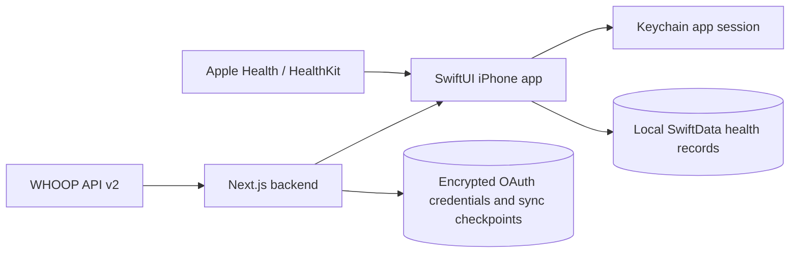

# Architecture

**Status:** Milestones 5–6 (trends and Personal Experiment Lab), workout/HealthKit stability
improvements, redesign phases 1–5, and the native Today / Work / Body field-journal shell integrated

**Last updated:** September 3, 2026

`PROJECT_PLAN.md` is the product source of truth. This document records the architecture that is
currently implemented.

The journal navigation preserves independent native navigation stacks and presents Settings from
a gear. Shared paper, typography, controls, and vector strokes live in `FieldJournal.swift`.
Fonts are bundled resources; rendering never fetches a font from the network. The visual migration
does not change persistence schemas, HealthKit anchors, parser behavior, or readiness calculations.
Today retains expanded diagnostics; Work retains all plan/actual editing; Body retains all trends,
experiments, and exports behind focused links. See `DESIGN.md` for the visual scope and limits.
Settings exposes a first-class Restrictions route for creating, editing, disabling, deleting, and
mapping restrictions. Body’s “Choose restriction” control selects the record whose story is shown;
anatomical selection remains a separate affected-area flow.

The tab content and journal navigation occupy separate rows in a bounded vertical layout, so
the navigation cannot cover a scroll view's last action. `JournalForm` and `JournalList` retain
native control behavior with transparent rows on paper; shared link/input styles make editing
discoverable. Field focus flows through the existing UUID-based keyboard scope to draw focus
borders. The keyboard Done action uses a conditional bottom safe-area inset instead of a
floating keyboard toolbar, reserving space so it cannot cover the focused value. Wrapping
single-line values dismiss on Done; true multiline notes retain Return. Readiness color/status
mapping is presentation-only and does not alter stored scores.
Numeric workout controls validate input in Binding setters, rather than reverting published
model values in change observers. `WorkoutFieldInput` reconciles pending display text to the
latest accepted edit after the control receives it, without re-publishing the numeric model;
external model refreshes remain separate to prevent edit loops and preserve stored precision.
Completed-workout rows stack at accessibility sizes so titles keep
the full content width instead of competing with dates.
Default preparation also removes obsolete instructional copy from the exact shipped
right-triceps rationale. This idempotent content correction changes neither custom notes nor
record dates and needs no schema migration.

Restrictions can additionally store zero or more user-selected affected-area identifiers. The
domain-owned `BodyAreaCatalog` defines stable IDs, labels, laterality, front/back view, coarse
focus region, and deterministic display order. UI selection is the only writer: free-text injury
names, body regions, sides, and rationales are never parsed to infer anatomy. This keeps the map
auditable and prevents changing terminology from silently moving a restriction on the body.
The catalog covers practical external musculoskeletal regions across head/neck, torso/pelvis,
bilateral limbs, hands/fingers, and feet/toes; it is not a diagnostic anatomy ontology. Large
figure hit regions and finer list regions share stable IDs and deterministic ordering. Hip, groin,
and glute choices have one canonical torso/pelvis focus rather than duplicate IDs under a leg.

Picker navigation focus is transient UI state and is never merged into stored selection. Figure
highlights, rows, chips, selection counts, and confirmation labels project the same validated
selected-ID set. Body connects a restriction to its injury timeline through the stable
`injury:<restriction-id>` relationship rather than editable display names.

`InjuryRecord.affectedAreaIDsJSON` is an additive optional SwiftData column containing a JSON
array of catalog IDs. Reads discard unknown IDs and preserve valid IDs in catalog order; writes
store nil for an empty selection. Existing stores therefore upgrade without a reset, existing
restrictions remain unmapped until the user chooses areas, and future catalog additions do not
change historical selections. The Body screen and restriction editor share the same picker and
repository save path; the map does not affect readiness or restriction-demand evaluation.

The combined app keeps one SwiftData container with 20 record types: source history,
assessment/configuration, standalone pain events, planned/actual work, movement definitions,
experiments, protocols, and docket completions. Existing entity names and legacy whole-second
workout fields are retained; precise duration/result fields remain additive and optional.
`scripts/verify-store-upgrades.mjs` generates synthetic disk-backed stores from each pre-integration
schema and verifies their fields against the combined schema. This macOS storage check complements
iOS tests; it does not read phone data or replace physical-device acceptance. See
`BRANCH_INTEGRATION.md` for the branch checkpoints and update procedure.

## System boundary



The backend is the only component that receives the WHOOP client secret, access token, or refresh
token. The app receives a separate signed app session and stores it in Keychain. WHOOP health
payloads pass through the backend response but are persisted only on the phone.

Installed iPhone builds use `https://whoopsididitagain-backend.vercel.app`; local schemes can
override the backend with `WHOOPS_BACKEND_URL`. Production OAuth state, encrypted credentials, and
sync checkpoints persist in the Vercel-linked Neon PostgreSQL database.

HealthKit access is read-only and never passes through the backend. The app requests each selected
sample type independently, so categories the user denies behave as empty sources while allowed
categories continue synchronizing.

HealthKit observer registration is claimed under a lock before the first `await`. Manual and
observer-triggered imports share a suspending FIFO permit in `LiveHealthKitRepository`; the permit
covers query, persistence, and anchor advancement for all pages of one metric. This prevents actor
reentrancy from activating parallel anchored queries or committing results based on stale anchors.
Cancellation removes queued waiters promptly; an active query settles before releasing the permit,
and cancelled batches are not committed. Cached history reads do not wait for that permit.
Metric-inclusion notifications publish on `MainActor`. See `HEALTHKIT_STABILITY.md` for the
reproduced races, regression coverage, and limits of the original simulator crash diagnosis.

Direct WHOOP sleep is authoritative when available. Primary overnight sleep is assigned to its
wake day, and duration is the rounded sum of light, slow-wave, and REM stages. Apple Health sleep
is used only as a fallback for a day without a completed primary WHOOP sleep.

## Form keyboard focus

Text-entry screens own a `FocusState<UUID?>` and install `formKeyboardScope`. Fields opt into that
scope with `formKeyboardField`, using stable per-view IDs so repeated labels do not share focus.
The scope dismisses the keyboard as scrolling begins and clears semantic focus on the user-driven
scroll phase, so the keyboard accessory cannot revive it. It offers one keyboard Done action and
clears focus on screen disappearance or app inactivity. Single-line Return submits dismiss focus;
multiline notes retain Return/newline behavior. Search fields use SwiftUI's `searchFocused` with
the same scope.

Save, cancel, duplicate, and destructive-confirmation actions clear their screen's focus before
proceeding. Train additionally clears its paste-field focus before parsing or presenting editors
or protocol capture, and when those presentations close, so dismissal cannot revive the underlying keyboard. The
pattern is used across workout entry/review/completion, movement management, check-ins, overrides,
restrictions, and experiment editing. Do not reintroduce process-wide responder broadcasts, timed
keyboard workarounds, or whole-form tap gestures that interfere with input and controls.

## WHOOP connection

1. The app creates a stable installation UUID in Keychain.
2. The backend creates an eight-character WHOOP OAuth state and stores only its hash.
3. `ASWebAuthenticationSession` opens the WHOOP authorization page.
4. The backend callback consumes the state, exchanges the WHOOP code, encrypts the rotating token
   pair with AES-256-GCM, and redirects to `whoops://oauth/callback` with a one-time code.
5. The app exchanges that code for a 15-minute access session and a 30-day refresh session.
6. WHOOP refresh-token rotation runs under a per-installation lock and persists both replacement
   tokens atomically.

Production uses PostgreSQL and the migration in `backend/migrations`. Non-production runs without
`DATABASE_URL` by using an intentionally ephemeral in-memory store.

## Synchronization and storage

Initial synchronization fetches the previous 180 days of cycles, recoveries, sleeps (including
naps), and workouts. Each collection is paginated until WHOOP omits `next_token`. Later runs begin
48 hours before each resource checkpoint to tolerate late updates and clock skew. No checkpoint is
advanced if any resource fetch fails.

The app stores each raw source record using the stable key `<resourceType>:<sourceIdentifier>` and
updates it idempotently. Basic recovery and sleep projections are derived locally for Today and
Trends. The backend stores only credentials, WHOOP user ID, app installation/session metadata, and
per-resource checkpoints.

HealthKit synchronization uses one archived `HKQueryAnchor` per sample type. New samples are
upserted by HealthKit UUID and deleted-object callbacks remove only the matching local source
record. The initial query window is 180 days. Each sample type is read in pages of at most 500;
each page is committed in a fresh SwiftData context before its anchor advances. A page prefetches
its stable record IDs in one bounded query rather than issuing one lookup per sample. Daily history
aggregates only the metrics used by the requested projection, using bounded stable-ID keyset pages
over the existing unique record index outside the main UI actor. Repository caches are keyed by
the requested metric set and are
invalidated whenever an anchored page is committed. Observer queries trigger the same anchored
path; background delivery is opportunistic. Every sample stores its
source, source bundle, source-time-zone identifier, UTC offset, and local calendar day. This keeps
historical day grouping stable when the phone later travels or crosses a DST boundary.

Apple Health authorization, local retention, and analytical inclusion are separate concerns.
Settings stores exclusions as metric identifiers, while new metrics default to included. The live
repository intersects every requested projection with this preference before returning data, clears
its projection cache after a preference change, and notifies visible Today and Trends views to
reload. Synchronization and normalized storage continue for excluded metrics so the choice remains
instant and reversible.

WHOOP and HealthKit workout records remain independent. A separate link records likely duplicates
when start time and duration are close. WHOOP HRV RMSSD and Apple Health HRV SDNN are also separate
metrics rather than a blended series.

## Daily assessment

The app owns the complete assessment path locally. SwiftData stores one morning check-in per local
day, editable injury and movement restrictions, sleep-schedule settings, and the calculated
assessment. A calculation record retains its ruleset version, component scores, confidence, reason
codes, and strongest signals. A user override and annotation are stored alongside, rather than
replacing, the calculated recommendation.

`readiness-1.0.1` uses robust 28-day medians and median absolute deviations for source-specific
physiology trends. WHOOP HRV RMSSD and Apple Health HRV SDNN never share a baseline. Fewer than 14
observations suppress strong baseline claims and reduce confidence. Missing current physiology,
sleep, check-in, or restriction context likewise reduces confidence and produces an explicit reason
code.

The engine calculates systemic, sleep, and tissue components before selecting a recommendation.
An active `avoid` restriction caps a completed check-in's tissue score at 39, the upper bound of the
existing low-tissue band, and remains a hard constraint that forces `Modify` even when recovery is
high. The cap never raises a lower symptom-derived score, and a missing check-in still produces no
tissue score. The Today screen presents the strongest reasons and the effective recommendation.
Sleep deadlines are derived locally from wake time, sleep target, expected latency, and wind-down
duration.

## Standalone pain log

`PainLogEntry` is a separate user-authored event stream with a stable body-area ID, 0–10 intensity,
optional note, and occurrence time. It deliberately does not reuse `MorningCheckIn`: logging pain
at an arbitrary time cannot change readiness inputs or experiment outcomes. `PainLogRecord` is a
new SwiftData entity, so existing stores gain the stream without changing or backfilling any prior
record. Saves are idempotent by entry ID; history is newest-first; deletes require plain-language
confirmation and remove only the selected local event.

The editor uses the domain-owned `BodyAreaCatalog`, reuses recent or actively restricted areas as
suggestions, and reuses the on-device dictation adapter for the optional note. Body shows matching
events only when their area ID belongs to the selected restriction; this is a descriptive timeline,
not a diagnosis, causal claim, readiness signal, or movement-clearance rule.

The static Home Screen quick action stores a one-shot `.painLog` route through the same app-owned
pending-route boundary used by reminders. Cold and warm launches present the editor without moving
health data into an extension or App Group. The `whoops://pain` URL reaches the same editor. On the
Body map, tap keeps its existing affected-area behavior; long press opens a preselected pain log,
with a named VoiceOver action providing the equivalent non-gesture path.

## Workout planning and completion

Workout processing is local. The deterministic fallback, `deterministic-1.5.0`, preserves the
raw text, normalizes known aliases through a canonical movement catalog, extracts only quantities it
can identify, and creates an explicit ambiguity for anything unknown or incomplete. The complete
payload boundary is defined by `contracts/workout-parser.schema.json`; the same domain validator
rejects invalid confidence, nonpositive quantities, empty segments, and unknown canonical IDs. A
model may propose this payload, but cannot bypass validation or the manual-entry fallback.

The optional `apple-extraction-2.0.0` prototype uses Apple's on-device Foundation Models framework
on iOS 26 and later. `LibraryWorkoutParser` takes one merged movement-catalog snapshot. Normal app
wiring supplies no model, regardless of any stored opt-in, and Train hides the experimental controls
because the live-model accuracy gate failed. Only DEBUG simulator runs with an explicit synthetic
test-provider mode expose those controls; the standalone Mac harness evaluates the real model.
The staged extractor splits numbered source lines in code, removes
explicit reported results, and sends exactly one line to each fresh session, sequentially. Apple
returns one explicit label such as `exercise_line` or `strength_header`; code maps that label to
role/format fields. Apple never supplies quantities or line IDs. It receives no health history or
restrictions, has no tools, and never calls a cloud model or the backend. Model sessions are created on demand and
serialized; a cancelled or timed-out session cannot overlap another model allocation.

Code extracts literal quantity tokens from each original line. The adapter verifies those quotations,
converts units in code, resolves canonical IDs from source lines against the catalog, and validates the resulting
domain payload. It rejects invented values, invalid source references, duplicated movement lines,
and rest without source evidence. Omitted lines and quantities remain visible as review notes.
The app also falls back when an AI draft drops source numbers or leaves source lines unstructured;
the standalone evaluation bypasses that routing so fallback cannot mask model errors.
The current bounded schema handles one movement per source line; complex or unsupported syntax may
need the deterministic fallback or manual correction. Only the exact string `null` is normalized to
absence for optional quantity fields to accommodate observed system-model output.

AI input is limited to 2,400 numbered-source UTF-8 bytes and 16 parts, each generation to 40 response
tokens, and the entire attempt to 20 seconds (not 20 seconds per part). Code owns source order,
segment assembly, and completeness checks. A failed part discards the entire staged draft; the app
does not mix successful AI fragments with silently guessed replacements. Conflicting formats or
ambiguous repeat scope require fallback. Failure returns the deterministic draft with a visible explanation;
user cancellation returns no draft. The UI snapshots input and rejects late results, keeps manual
entry available, and cancels on navigation away or backgrounding. Parser provenance and OS/build-based
model identity are retained; Apple does not expose an exact stable model weight revision. The Apple
prototype itself adds no storage fields. See [Apple parser verification](APPLE_WORKOUT_PARSER.md)
for the live-model evaluation; the editor's additive persistence changes are described below.

Compatibility Unicode is normalized before classification, so mathematical-bold programming parses
like ordinary text. A standalone heading becomes the plan title. Repeated one-movement efforts with
a common explicit rest are represented as one interval segment with `restSeconds`; heart-rate and
intended-RPE targets remain editable context rather than becoming movement rows.
Version 1.4 keeps time caps out of movement rows, recognizes strength/set headings, preserves
unmapped movement quantities, supports clock durations, and retains separate rest between different
movements or at the end. Numeric alternatives, ranges, and negative quantities require review.

Leading list bullets are removed for classification and quantity extraction while `rawText` retains
the complete paste. Spelled-out "as many rounds as possible" is recognized as AMRAP; parenthesized
and bare `#` loads are normalized to pounds. `Score:`, `Result:`, and `Completed:` lines are excluded
from format, round-count, and duration detection and preserved as explicitly labeled reported-result
notes on the first segment. They do not become movement rows, stimulus targets, or completed-workout
records. Version 1.5 also extracts one unambiguous round-plus-repetition score into an optional
`WorkoutReportedResult`. The editor shows completed rounds and additional reps separately from
prescribed rounds. For one rep-based AMRAP/rounds segment, deterministic totals multiply per-round
reps by completed rounds, then distribute extras in movement order. Mixed-unit or multi-segment
workouts and extras reaching another full round require manual totals. Actual-work logging prefills
these totals for review but never saves a completion automatically. The raw source remains unchanged;
unsupported result syntax stays in notes. Legacy plans retain their existing notes without automatic
reinterpretation; re-paste or add a reported result to populate structured fields. A cleared saved
snapshot does not reparse stale text.

The review editor also exposes a per-movement Reported total reps field. User corrections live in
`WorkoutPlan.reportedRepetitionOverrides`, keyed by prescription ID, outside parsed prescriptions.
An additive optional `WorkoutPlanRecord.reportedRepetitionOverridesData` JSON snapshot preserves
them; absent data means no overrides for older stores. Counts are whole numbers from 0 through
100,000. Corrected counts take precedence for display and completion prefill without rewriting the
score or per-round reps. Score changes retain explicit corrections; Use calculated total removes
one. Duplicates receive no copied correction, and deleting a movement/segment removes its orphaned
corrections. Unknown actual reps stay blank if the plan contains reported work but cannot calculate
that movement's total. Editing a plan never changes an already-recorded completion.

All workout duration editors use decimal minutes (at most two decimal places), with fractional
seconds in domain models. Existing integer SwiftData columns remain intact; additive optional
Double columns store precision and take precedence when present. Plan and completion records have
optional result snapshots, while movement records gain explicit ordering. The lbs/kg pickers store
canonical lb/kg without converting the entered load. Duplicate actions copy every prescription field
with a new UUID and insert immediately after the source; edits and deletion remain independent.

The bundled library includes an explicit overhead/American kettlebell swing, with kettlebell
equipment and repetition/load/duration measurements. Generic or Russian swing wording is not
silently mapped to the overhead variation. Its overhead and elbow-extension tags conservatively
represent the straight-arm overhead finish described by the
[CrossFit movement standard](https://games.crossfit.com/workouts/regionals/2011?division=11);
these are editable application heuristics, not individualized medical clearance.

For a non-rest segment, `restSeconds` means one uniform recovery between repeated rounds or efforts.
A dedicated `rest` segment instead stores its required recovery length in `durationSeconds` and has
no movements, rounds, or secondary `restSeconds`. This makes variable recovery an explicit sequence
of work and rest segments and prevents either representation from silently overriding the other.

`workout-scaling-1.0.1` intersects movement-demand tags with active restriction demands. An `Avoid`
match is a hard conflict and returns `Modify`; softer matches return `Proceed with limits`. Candidate
substitutions come only from the approved catalog and are filtered so they do not retain the matched
restricted demand. Explanations state the intended stimulus being preserved and the movement
specificity that may be lost.
An unmapped movement produces an explicit incomplete-evaluation caution for each active restriction
instead of being silently skipped. It does not receive automatic substitution candidates.

SwiftData stores workout plans, segments, and prescriptions independently from completed workouts
and completed movements. Completion starts as an editable copy of the plan, then saves actual
repetitions, distance, calories, load, duration, modifications, movement pain, session RPE, and
post-session pain without rewriting the planned values. Completion fields retain visible labels
after values are populated, matching the review flow.

The Train screen treats saved cards as navigable records. A planned-workout detail view reads the
stored overview, stimulus, restriction evaluation, segment structure, prescriptions, and original
source without mutating them. Recent completed-workout rows similarly open the actual session values;
both detail screens expose an explicit Edit action. `WorkoutCompletionView` has distinct creation
and existing-record initializers: editing copies the saved completion, never refills it from a plan,
and updates the detail snapshot after a successful save. A cancelled or failed save keeps persisted
values intact. The repository validates before mutation and rejects movement IDs owned by another
completion. Existing-record upserts preserve identity and ordering, avoiding duplicate workouts.

Completed session duration is derived from start/end timestamps. Start edits shift the end by the
same elapsed duration; duration edits move the end; end edits refresh the duration input. Session
and movement fields, scores, and movement membership/order are editable, while source identities
and parser provenance remain system-managed. Planned details also expose schedule, duration-range,
and structural edits. Estimated stimulus durations accept decimal minutes in their existing JSON
snapshot and continue to decode older integer values. See `WORKOUT_EDITING.md` for the field audit.

The effective movement catalog is a deterministic merge of bundled definitions and local personal
records. Plans and completions reference stable movement identifiers, while repetitions, load,
distance, duration, tempo, modifications, and pain remain workout-specific. Search recency and
frequency are derived from saved workout history rather than stored as counters.

Parser matching, schema validation, and restriction evaluation receive the same merged catalog
snapshot. Personal movements without reviewed demand tags remain usable for planning, but generate
a manual-review caution when an active restriction exists instead of receiving an affirmative safe
result.

WOD Lab migration is local-only and idempotent. The version 1 adapter reads `stores.movements`,
validates records, maps supported stable fields, previews additions and matches, and commits only
after confirmation. It does not import workout history, prescriptions, technique notes, or coaching
metadata in this increment.

## PT protocol intake

Protocol intake (`docs/DESIGN.md` phase 1) offers three equal paths into one deterministic
parser: a VisionKit document scan whose pages run through on-device Vision text recognition,
paste, and dictation. Recognition and dictation never leave the phone; dictation requires
on-device speech support and otherwise declines with a pointer to paste. `protocol-1.0.0`
normalizes compatibility Unicode, preserves every line as an item, extracts only explicit
quantities (sets, repetitions, hold durations, load) and cadence phrases, and reads optional
phase and unlock-milestone metadata. Movement resolution reuses the merged movement catalog:
an exact name or alias match resolves; word-overlap partial matches surface as candidate
choices the user must tap; everything else is marked new and can be added to the personal
movement library with one tap. The parser never picks a movement on its own.

The parse review presents items as cards with preset cadence chips (daily, n-per-week, custom
weekdays), candidate chips for ambiguities, swipe-to-drop rows with transient undo, and a
restriction line computed by the existing scaling engine over a transient plan built from the
resolved items, so protocol items and workouts share one restriction evaluation. Saving
validates the protocol (all items resolved to known movements, cadences valid) and stores it in
SwiftData as protocol and item records.

## Daily docket

`docket-1.1.0` generates the Today checklist deterministically on demand from stored protocols,
workout plans, sleep settings, and recorded completions; no docket rows are written ahead of
time, so editing or deleting a protocol can never leave stale entries. Daily and weekday
cadences resolve against the local calendar day, and a times-per-week item stays due until its
target number of completions exists within the calendar week (honoring the calendar's first
weekday), with the week's count shown on the row. Protocol active ranges and archival gate
generation. Today's committed workout plans appear as buttons that launch
`WorkoutCompletionView`, the same record-actual flow the Train tab uses, rather than completing
inline from a docket tap — completing a workout needs session RPE and pain values the docket
cannot invent, so it defers to that flow instead of inventing them. The sleep wind-down item
derives from the existing sleep-deadline calculation.

Completing a protocol or wind-down item stores one completion per item per local day (an upsert
by day, kind, and source); the same upsert now overwrites any previously recorded actual, so
re-logging a mis-tap is idempotent rather than stacking rows. Completions are the only persisted
docket state.

A one-tap completion is a user assertion that the prescription was met, so it snapshots the
item's prescribed sets, repetitions, and hold duration into the stored completion at the moment
of completion — editing the protocol afterward can never rewrite what was actually logged.
`DocketCompletionRecord` carries this as six additive optional columns (`actualSets`,
`actualRepetitions`, `actualDurationSeconds`, `painDuring`, `actualNote`, `isAsPrescribed`); all
six nil is a legacy phase-2 tap that made no claim about quantities at all, and legacy rows are
never backfilled. `isAsPrescribed` is the decode sentinel: it is always set whenever an actual is
written, so its absence is what marks a row as legacy rather than a deliberate "nothing logged"
value.

On Today, a protocol or wind-down row completes as prescribed with one tap; a trailing "log
details" button opens a sheet for logging a deviation instead — edited sets/reps/hold-duration,
an optional pain chip (nil until tapped, never defaulted), and a note. The transient undo bar
gains a second "adjust" action that reopens the same sheet seeded from the completion just
written, so a mis-tap becomes a correction rather than undo-and-redo. A completed row renders a
short deviation aside (e.g. `2×15 · pain 1`) only when its actual is not as-prescribed; an
as-prescribed row looks exactly as it always has. The chip/stepper controls that back this sheet
(`JournalStepper`, `JournalScaleChip`/`JournalScaleChipRow`) also replaced the number-pad text
field and sliders on `WorkoutCompletionView` (session RPE, post-session pain, per-movement pain,
actual repetitions) and `MorningCheckInView` (pain-at-rest, pain-with-movement, energy,
motivation), so none of these one-handed entry points require a keyboard. Docket-launched workout
recording and per-set protocol actuals ship in this phase; adherence summaries do not and remain
a later phase.

CI builds the app and test bundles and runs the iOS unit-test suite on an iOS Simulator for
every push; UI tests remain build-only in CI and run locally.

## Outside-app docket completion

Phase 4 keeps SwiftData and all health, workout, and check-in history inside the app container.
The widget and App Intents share only a narrow, versioned App Group bridge:

```text
docket engine -> current-docket snapshot -> widget / App Intent
                                             |
                                             v
                                      completion action file
                                             |
app becomes active -> reconcile through DocketRepository -> refreshed snapshot -> acknowledge
```

The snapshot contains today's user-visible docket rows and their prescribed quantities. It never
contains health history, raw provider payloads, credentials, sessions, or encryption material.
Outside-app completion writes one durable JSON file per action rather than mutating SwiftData.
Pending actions are overlaid on the snapshot so the widget responds immediately, while the app
remains the only process that persists a completion.

Reconciliation reuses the repository's idempotent local-day/kind/source upsert. The app publishes
the refreshed snapshot before acknowledging processed actions, so interruption can repeat a write
without stacking completions or losing the user's tap. One-tap completion is limited to protocol
and wind-down items that can be asserted as prescribed. Workout rows deep-link into the app because
session RPE, pain, and actual work require explicit input. Local notification actions and voice
phrases reuse this bridge rather than introducing another persistence path.

The reminder scheduler is app-owned, local, and explicitly opt-in. Its repeating times are derived
from `SleepScheduleSettings` and refreshed on app launch and every saved schedule change. Morning
actions can open the existing check-in or snooze for 15 minutes but cannot write answers. Wind-down
Done queues only the current day's eligible wind-down row; Later schedules only a one-shot snooze.
App Shortcut entities include the local day in their identifier, and the widget, notifications, and
voice resolver all reject a cached snapshot whose day is no longer current. Notification permission
and reminder preferences stay in app-owned system/UserDefaults storage; neither enters the App Group.

## Repository

- `ios/WhoopsApp`: SwiftUI app, Keychain session store, SwiftData persistence, tests
- `backend`: Next.js App Router OAuth/sync service, PostgreSQL adapter, Vitest tests
- `contracts`: v1 JSON Schema contracts mirrored by Swift `Codable` models
- `fixtures`: synthetic-only test inputs
- `docs`: product, architecture, decisions, and execution status

## Trends, weekly review, and export

Milestone 5 reads normalized local projections through repository protocols; the analytics engine
does not query SwiftData or external services directly. It builds source-specific recovery and sleep
observations, session-RPE load, unit-preserving strength volume, current injury records, and
descriptive pain-by-movement summaries. Seven-day results compare with the preceding seven days,
while robust baselines use at most 28 observations.

The structured weekly report is deterministic and versioned. Every claim includes its observation
count or states that the available data is insufficient, uses association language, and includes one
action plus one caveat. Optional narration is a presentation adapter over that report and is never a
calculation or safety authority.

Local export serializes only normalized app-facing records and derived summaries. JSON preserves
structure; CSV uses one record-type column and stable flattened fields. Raw WHOOP payloads, OAuth
credentials, app sessions, Keychain contents, backend environment values, and encryption material
are outside the export boundary.

## Personal Experiment Laboratory

Milestone 6 introduces a separate local repository for experiment definitions and condition-day
observations. One observation is upserted per experiment and local calendar day. A single daily
check-in can save condition choices for every active experiment, avoiding a separate navigation and
save flow per experiment. Today exposes that check-in when the feature is enabled and at least one
experiment is active; Experiment Lab retains setup, backfill, correction, and analysis. New
definitions start active unless the user deliberately chooses another status. Excluding a day
retains its assignment, reason, confounders, and notes;
the repository never copies vendor payloads or credentials into experiment records.

Experiment detail loads saved condition days before starting outcome analysis. Analysis requests
only the repository source required by the selected outcome: WHOOP history for WHOOP metrics,
the matching Apple Health metric for Apple outcomes, completed workouts for session load, or
morning check-ins for pain. Saving updates the visible condition-day list immediately after the
durable write and refreshes analysis independently. The UI reports both logged assignments and
usable assignments with resolved outcomes; the configured minimum continues to apply only to
usable values in each condition.

User-entered records follow a deletion rule at the repository boundary. Experiment observations,
experiments, morning check-ins, restrictions, workout plans, completed workouts, and readiness
overrides can be removed from their owning screen after plain-language confirmation. Deleting an
experiment cascades only to its condition-day observations. Deleting a completed workout removes
its actual movement rows and returns its linked plan to planned when no other completion refers to
that plan. Movement definitions are the exception: saved workouts may refer to their stable IDs, so
the library archives them and tells the user that past workout details are being preserved.
The sleep schedule is required to calculate deadlines, so its removal action restores documented
defaults and explains why an empty state is not supported.

`experiments-1.1.0` consumes the already normalized `TrendsSnapshot` plus morning check-ins. A
condition records what actually happened on its local day. The experiment explicitly resolves its
outcome on that same day or the following local day, preventing morning physiology from being
silently attributed to a later behavior. It then compares included intervention and comparison
means in the metric's native unit. A difference is withheld until both conditions meet the
configured per-condition minimum. The output always reports both custom condition names, sample
sizes, missing outcomes, remaining days, evidence status, and a non-causal caveat.

The laboratory is behind an off-by-default `UserDefaults` feature flag exposed in Settings. A launch
environment override exists for UI automation. The UI uses native NavigationStack, List, Form,
Picker, Toggle, DatePicker, and sheet patterns, with Dynamic Type and VoiceOver-compatible labels.

Predictive dose-response modeling, interval pacing, anomaly notifications, natural-language
historical questions, webhooks, additional equipment integrations, clinical export, and matched-day
causal adjustment remain deferred. Parsing, scaling, readiness, trends, experiments, weekly review,
and export do not depend on an LLM.

## Left-thumb editing and PT summary (September 4, 2026)

Editors share bottom Save actions, handed microphone placement, and a protected local draft
store in Application Support. Versioned draft envelopes are keyed by editor and source/day,
written atomically after a short debounce and flushed on dismissal/backgrounding. They are
separate from SwiftData clinical records and never participate in analytics. Resume is explicit;
discard is confirmed. Successful saves clear drafts; source deletion removes associated drafts.

New check-ins require score and symptom answers. New workout completions require confirmation
of actual work, duration, RPE, and post-session pain. Copied movement quantities are explicitly
reviewed through the quick or detailed path. Additive `painWasReported` metadata distinguishes
new unrecorded movement pain from explicit zero; absent metadata preserves legacy values.
Pain summaries and CSV exports omit unrecorded pain rather than counting it as zero.

Bring to PT builds one deterministic summary model for native preview and selectable-text PDF.
The default inclusive interval is the last 14 local calendar days. It includes current restrictions
and prescriptions, dated protocol completions, workout modifications, standalone pain, and editable
questions. Current recurrence is never used to manufacture historical adherence denominators.
PDF generation is local; sharing is initiated through the system share sheet. No clinical milestones,
healing timelines, causal conclusions, or medical clearance are inferred.
