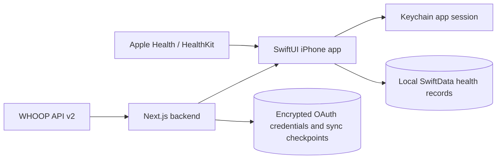

# Architecture

**Status:** Milestone 5 trends and weekly review implemented
**Last updated:** August 21, 2026

`PROJECT_PLAN.md` is the product source of truth. This document records the architecture that is
currently implemented.

## System boundary

The backend is the only component that receives the WHOOP client secret, access token, or refresh
token. The app receives a separate signed app session and stores it in Keychain. WHOOP health
payloads pass through the backend response but are persisted only on the phone.

Installed iPhone builds use `https://whoopsididitagain-backend.vercel.app`; local schemes can
override the backend with `WHOOPS_BACKEND_URL`. Production OAuth state, encrypted credentials, and
sync checkpoints persist in the Vercel-linked Neon PostgreSQL database.

HealthKit access is read-only and never passes through the backend. The app requests each selected
sample type independently, so categories the user denies behave as empty sources while allowed
categories continue synchronizing.

Direct WHOOP sleep is authoritative when available. Primary overnight sleep is assigned to its
wake day, and duration is the rounded sum of light, slow-wave, and REM stages. Apple Health sleep
is used only as a fallback for a day without a completed primary WHOOP sleep.

## WHOOP connection

1. The app creates a stable installation UUID in Keychain.
2. The backend creates an eight-character WHOOP OAuth state and stores only its hash.
3. `ASWebAuthenticationSession` opens the WHOOP authorization page.
4. The backend callback consumes the state, exchanges the WHOOP code, encrypts the rotating token
   pair with AES-256-GCM, and redirects to `whoops://oauth/callback` with a one-time code.
5. The app exchanges that code for a 15-minute access session and a 30-day refresh session.
6. WHOOP refresh-token rotation runs under a per-installation lock and persists both replacement
   tokens atomically.

Production uses PostgreSQL and the migration in `backend/migrations`. Non-production runs without
`DATABASE_URL` by using an intentionally ephemeral in-memory store.

## Synchronization and storage

Initial synchronization fetches the previous 180 days of cycles, recoveries, sleeps (including
naps), and workouts. Each collection is paginated until WHOOP omits `next_token`. Later runs begin
48 hours before each resource checkpoint to tolerate late updates and clock skew. No checkpoint is
advanced if any resource fetch fails.

The app stores each raw source record using the stable key `<resourceType>:<sourceIdentifier>` and
updates it idempotently. Basic recovery and sleep projections are derived locally for Today and
Trends. The backend stores only credentials, WHOOP user ID, app installation/session metadata, and
per-resource checkpoints.

HealthKit synchronization uses one archived `HKQueryAnchor` per sample type. New samples are
upserted by HealthKit UUID and deleted-object callbacks remove only the matching local source
record. The initial query window is 180 days. Each sample type is read in pages of at most 500;
each page is committed in a fresh SwiftData context before its anchor advances. A page prefetches
its stable record IDs in one bounded query rather than issuing one lookup per sample. Daily history
aggregates only the metrics used by the requested projection, using bounded stable-ID keyset pages
over the existing unique record index outside the main UI actor. Repository caches are keyed by
the requested metric set and are
invalidated whenever an anchored page is committed. Observer queries trigger the same anchored
path; background delivery is opportunistic. Every sample stores its
source, source bundle, source-time-zone identifier, UTC offset, and local calendar day. This keeps
historical day grouping stable when the phone later travels or crosses a DST boundary.

WHOOP and HealthKit workout records remain independent. A separate link records likely duplicates
when start time and duration are close. WHOOP HRV RMSSD and Apple Health HRV SDNN are also separate
metrics rather than a blended series.

## Daily assessment

The app owns the complete assessment path locally. SwiftData stores one morning check-in per local
day, editable injury and movement restrictions, sleep-schedule settings, and the calculated
assessment. A calculation record retains its ruleset version, component scores, confidence, reason
codes, and strongest signals. A user override and annotation are stored alongside, rather than
replacing, the calculated recommendation.

`readiness-1.0.0` uses robust 28-day medians and median absolute deviations for source-specific
physiology trends. WHOOP HRV RMSSD and Apple Health HRV SDNN never share a baseline. Fewer than 14
observations suppress strong baseline claims and reduce confidence. Missing current physiology,
sleep, check-in, or restriction context likewise reduces confidence and produces an explicit reason
code.

The engine calculates systemic, sleep, and tissue components before selecting a recommendation.
An active `avoid` restriction is a hard constraint and forces `Modify` even when recovery is high.
The Today screen presents the strongest reasons and the effective recommendation. Sleep deadlines
are derived locally from wake time, sleep target, expected latency, and wind-down duration.

## Workout planning and completion

Workout processing is local and deterministic in `deterministic-1.2.0`. The parser preserves the
raw text, normalizes known aliases through a canonical movement catalog, extracts only quantities it
can identify, and creates an explicit ambiguity for anything unknown or incomplete. The complete
payload boundary is defined by `contracts/workout-parser.schema.json`; the same domain validator
rejects invalid confidence, nonpositive quantities, empty segments, and unknown canonical IDs. A
future LLM may propose this payload, but cannot bypass validation or the manual-entry fallback.

Compatibility Unicode is normalized before classification, so mathematical-bold programming parses
like ordinary text. A standalone heading becomes the plan title. Repeated one-movement efforts with
a common explicit rest are represented as one interval segment with `restSeconds`; heart-rate and
intended-RPE targets remain editable context rather than becoming movement rows.

For a non-rest segment, `restSeconds` means one uniform recovery between repeated rounds or efforts.
A dedicated `rest` segment instead stores its required recovery length in `durationSeconds` and has
no movements, rounds, or secondary `restSeconds`. This makes variable recovery an explicit sequence
of work and rest segments and prevents either representation from silently overriding the other.

`workout-scaling-1.0.0` intersects movement-demand tags with active restriction demands. An `Avoid`
match is a hard conflict and returns `Modify`; softer matches return `Proceed with limits`. Candidate
substitutions come only from the approved catalog and are filtered so they do not retain the matched
restricted demand. Explanations state the intended stimulus being preserved and the movement
specificity that may be lost.

SwiftData stores workout plans, segments, and prescriptions independently from completed workouts
and completed movements. Completion starts as an editable copy of the plan, then saves actual
repetitions, distance, load, duration, modifications, movement pain, session RPE, and post-session
pain without rewriting the planned values.

The Train screen treats saved cards as navigable records. A planned-workout detail view reads the
stored overview, stimulus, restriction evaluation, segment structure, prescriptions, and original
source without mutating them. Recent completed-workout rows similarly open the actual session values;
editing and completion remain separate explicit actions.

The effective movement catalog is a deterministic merge of bundled definitions and local personal
records. Plans and completions reference stable movement identifiers, while repetitions, load,
distance, duration, tempo, modifications, and pain remain workout-specific. Search recency and
frequency are derived from saved workout history rather than stored as counters.

Parser matching, schema validation, and restriction evaluation receive the same merged catalog
snapshot. Personal movements without reviewed demand tags remain usable for planning, but generate
a manual-review caution when an active restriction exists instead of receiving an affirmative safe
result.

WOD Lab migration is local-only and idempotent. The version 1 adapter reads `stores.movements`,
validates records, maps supported stable fields, previews additions and matches, and commits only
after confirmation. It does not import workout history, prescriptions, technique notes, or coaching
metadata in this increment.

## Repository

- `ios/WhoopsApp`: SwiftUI app, Keychain session store, SwiftData persistence, tests
- `backend`: Next.js App Router OAuth/sync service, PostgreSQL adapter, Vitest tests
- `contracts`: v1 JSON Schema contracts mirrored by Swift `Codable` models
- `fixtures`: synthetic-only test inputs
- `docs`: product, architecture, decisions, and execution status

## Trends, weekly review, and export

Milestone 5 reads normalized local projections through repository protocols; the analytics engine
does not query SwiftData or external services directly. It builds source-specific recovery and sleep
observations, session-RPE load, unit-preserving strength volume, current injury records, and
descriptive pain-by-movement summaries. Seven-day results compare with the preceding seven days,
while robust baselines use at most 28 observations.

The structured weekly report is deterministic and versioned. Every claim includes its observation
count or states that the available data is insufficient, uses association language, and includes one
action plus one caveat. Optional narration is a presentation adapter over that report and is never a
calculation or safety authority.

Local export serializes only normalized app-facing records and derived summaries. JSON preserves
structure; CSV uses one record-type column and stable flattened fields. Raw WHOOP payloads, OAuth
credentials, app sessions, Keychain contents, backend environment values, and encryption material
are outside the export boundary.

## Personal Experiment Laboratory

Milestone 6 introduces a separate local repository for experiment definitions and condition-day
observations. One observation is upserted per experiment and local calendar day. A single daily
check-in can save condition choices for every active experiment, avoiding a separate navigation and
save flow per experiment. Today exposes that check-in when the feature is enabled and at least one
experiment is active; Experiment Lab retains setup, backfill, correction, and analysis. New
definitions start active unless the user deliberately chooses another status. Excluding a day
retains its assignment, reason, confounders, and notes;
the repository never copies vendor payloads or credentials into experiment records.

Experiment detail loads saved condition days before starting outcome analysis. Analysis requests
only the repository source required by the selected outcome: WHOOP history for WHOOP metrics,
the matching Apple Health metric for Apple outcomes, completed workouts for session load, or
morning check-ins for pain. Saving updates the visible condition-day list immediately after the
durable write and refreshes analysis independently. The UI reports both logged assignments and
usable assignments with resolved outcomes; the configured minimum continues to apply only to
usable values in each condition.

User-entered records follow a deletion rule at the repository boundary. Experiment observations,
experiments, morning check-ins, restrictions, workout plans, completed workouts, and readiness
overrides can be removed from their owning screen after plain-language confirmation. Deleting an
experiment cascades only to its condition-day observations. Deleting a completed workout removes
its actual movement rows and returns its linked plan to planned when no other completion refers to
that plan. Movement definitions are the exception: saved workouts may refer to their stable IDs, so
the library archives them and tells the user that past workout details are being preserved.
The sleep schedule is required to calculate deadlines, so its removal action restores documented
defaults and explains why an empty state is not supported.

`experiments-1.1.0` consumes the already normalized `TrendsSnapshot` plus morning check-ins. A
condition records what actually happened on its local day. The experiment explicitly resolves its
outcome on that same day or the following local day, preventing morning physiology from being
silently attributed to a later behavior. It then compares included intervention and comparison
means in the metric's native unit. A difference is withheld until both conditions meet the
configured per-condition minimum. The output always reports both custom condition names, sample
sizes, missing outcomes, remaining days, evidence status, and a non-causal caveat.

The laboratory is behind an off-by-default `UserDefaults` feature flag exposed in Settings. A launch
environment override exists for UI automation. The UI uses native NavigationStack, List, Form,
Picker, Toggle, DatePicker, and sheet patterns, with Dynamic Type and VoiceOver-compatible labels.

Predictive dose-response modeling, interval pacing, anomaly notifications, natural-language
historical questions, webhooks, additional equipment integrations, clinical export, and matched-day
causal adjustment remain deferred. Parsing, scaling, readiness, trends, experiments, weekly review,
and export do not depend on an LLM.
