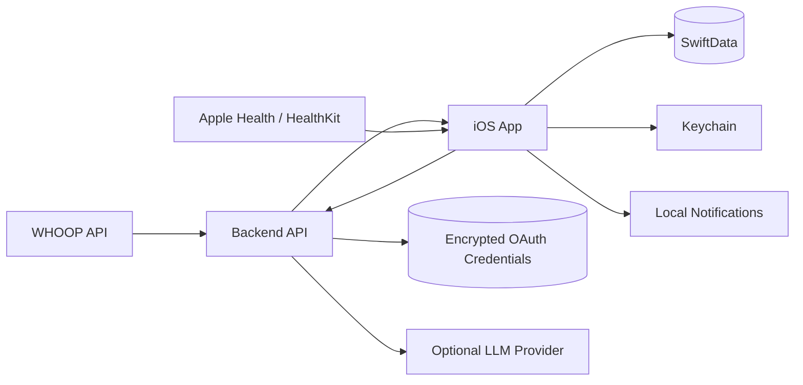

# WHOOPs, I Did It Again

## Product and Implementation Plan

**Status:** Initial implementation brief
**Version:** 0.1
**Date:** August 15, 2026
**Platform:** Personal iPhone app
**Distribution:** Installed directly on the owner’s iPhone; no public App Store release planned
**Primary user:** Robert
**Repository model:** Monorepo containing the native iOS app, backend services, tests, and documentation

---

## 1. Executive Summary

**WHOOPs, I Did It Again** is a private, single-user iPhone app that combines WHOOP, Apple Health, workout plans, actual training, injury symptoms, sleep constraints, and subjective feedback to produce useful daily and longitudinal training insights.

The app should not duplicate the WHOOP app. WHOOP already displays recovery, strain, and sleep effectively. This app should provide the missing interpretive layer:

> Given my systemic recovery, local tissue condition, intended workout, recent training history, schedule, and goals, what should I do today?

The product should close this loop:

```text
Physiological readiness
        ↓
Planned workout
        ↓
Recommended modifications
        ↓
Actual completed work
        ↓
Pain, effort, and performance
        ↓
Sleep and next-day recovery
        ↓
Better future recommendations
```

The central product distinction is between:

1. **Systemic readiness:** Cardiovascular, autonomic, sleep, and whole-body recovery.
2. **Tissue readiness:** Whether a particular tendon, joint, muscle group, or movement pattern is prepared for a particular load.

A high WHOOP Recovery score must never be interpreted as evidence that an injured tendon is ready for high-risk loading.

The app should begin as a deterministic, explainable decision-support system. Statistical models and LLM-generated explanations can be added where they provide value, but they must not replace auditable calculations or invent medical certainty.

---

## 2. User Context

The app is designed for a technically sophisticated, physically active primary user with the following relevant context:

- Male masters CrossFit athlete, age 50.
- Usually trains four to five times per week.
- Trains CrossFit, Olympic weightlifting, strength, intervals, Zone 2, and rehabilitation work.
- Current Olympic-lifting reference numbers include approximately:
  - Clean: 200 lb
  - Snatch: 150 lb
  - Front squat: 265 lb
- Tends to begin conditioning efforts aggressively and lose output later.
- Wants to improve pacing, aerobic capacity, Olympic-lifting technique, and training consistency.
- Has a known partial right distal triceps tendon injury, with the left triceps also potentially affected.
- Has a history of ACL surgery, intermittent foot-arch or calf symptoms, and episodic low-back irritation.
- Often trains in the evening.
- Usually wakes around 7:15 a.m. on commute days.
- Is a slow caffeine metabolizer and generally avoids caffeine after noon.
- Uses WHOOP and may also collect data through Apple Health and Apple Watch.
- Prefers evidence, transparent reasoning, and personalized baselines over generic wellness advice.
- Is comfortable manually recording a small amount of high-value context, provided entry is fast.
- Is an application developer and will maintain the app personally.

This context should inform defaults, but personal assumptions must remain editable in Settings.

---

## 3. Product Goals

### 3.1 Primary Goals

The app should:

1. Turn wearable data into a concrete daily training recommendation.
2. Distinguish whole-body readiness from local injury or tissue readiness.
3. Evaluate a planned workout against current restrictions.
4. Preserve the intended stimulus when recommending workout substitutions.
5. Record what was actually completed rather than assuming the plan was followed.
6. Connect training exposure with pain, performance, sleep, and subsequent recovery.
7. Explain why a metric or recommendation changed.
8. support structured personal experiments.
9. Reveal longitudinal patterns that are difficult to see in WHOOP alone.
10. Keep sensitive health data local whenever practical.

### 3.2 Success Criteria

The app is successful when it reliably answers questions such as:

- What kind of training makes sense today?
- What should be changed in today’s programmed workout?
- Why is my Recovery lower than usual?
- Did my sleep, recent strain, illness signals, or schedule most likely contribute?
- Which movements are associated with increased triceps pain the following day?
- Does a late CrossFit class measurably affect my sleep?
- Am I improving my pacing?
- How much Olympic-lifting practice produces the best response?
- What conditions tend to precede my best strength performances?
- Is a personal intervention producing a meaningful effect?

---

## 4. Non-Goals

The initial product is not intended to:

- Diagnose injuries, illnesses, sleep disorders, or other medical conditions.
- Replace a physician, surgeon, physical therapist, coach, or other qualified professional.
- Infer structural tendon healing from wearable signals.
- Provide autonomous clearance for injured movements.
- Serve multiple users.
- Support social feeds, leaderboards, teams, or coaching marketplaces.
- Reproduce every WHOOP screen.
- Publish to the App Store.
- Provide continuous live heart-rate monitoring from the WHOOP API.
- Optimize training through opaque machine-learning recommendations.
- Make causal claims from weak observational associations.
- Require cloud storage of the user’s complete health history.
- Gamify recovery in a way that encourages compulsive checking.

---

## 5. Product Principles

### 5.1 Systemic Readiness Is Not Tissue Readiness

The app must maintain independent assessments for:

- Autonomic and cardiovascular readiness
- Sleep sufficiency
- General fatigue
- Local tissue tolerance
- Planned-session compatibility
- Subjective willingness and confidence

A green systemic assessment must not cancel a local movement restriction.

### 5.2 Personal Baselines Beat Population Cutoffs

Metrics should be compared primarily against the user’s own rolling history.

For example:

```text
Current resting heart rate: 61 bpm
28-day median: 56 bpm
Difference: +5 bpm
Robust deviation: +1.7
```

The app may display general reference information, but recommendations should be driven by personal response whenever sufficient personal data exists.

### 5.3 Explain Every Recommendation

A recommendation should include:

- The recommendation
- The strongest supporting signals
- Important contrary evidence
- Missing data
- Confidence
- Any hard restrictions that overrode other signals

Example:

```text
Recommendation: Modify today’s session

Why:
- HRV is 13% below your 28-day median.
- Resting heart rate is 4 bpm above median.
- You slept 46 minutes less than your calculated need.
- Yesterday’s session included high triceps loading.
- Right-triceps pain is 3/10 this morning.

Override:
- Avoid ballistic elbow extension regardless of systemic Recovery.
```

### 5.4 Observation Is Not Causation

The app should use language such as:

- “associated with”
- “often followed by”
- “coincided with”
- “is a plausible contributor”
- “not enough observations yet”

It should avoid unjustified language such as:

- “caused”
- “proved”
- “guarantees”
- “your tendon has healed”
- “you are becoming ill”

### 5.5 Deterministic Core, Generative Interface

Code should calculate:

- Baselines
- Deviations
- Training loads
- Trend estimates
- Confidence scores
- Rule evaluation
- Experiment results

An LLM may:

- Parse loosely formatted workouts.
- Normalize movement names.
- Explain deterministic results.
- Produce concise summaries.
- Translate natural-language questions into approved query operations.
- Suggest candidate substitutions subject to explicit restrictions.

An LLM must not be trusted to perform important arithmetic or silently decide whether an injured movement is safe.

### 5.6 Local-First Privacy

The preferred architecture is:

- Health data stored locally on the iPhone.
- WHOOP credentials stored only in the secure backend.
- Minimal backend persistence.
- No third-party analytics SDK in the initial release.
- No logging of health payloads, OAuth tokens, or LLM prompts containing unnecessary health details.
- Explicit export and deletion controls.

### 5.7 Low-Friction Context Collection

The most valuable data may be data the wearables cannot observe:

- Pain
- Session RPE
- Intended versus actual work
- Movement substitutions
- Perceived weakness
- Illness symptoms
- Medication or intervention timing
- Psychological readiness

A routine check-in should generally take less than 15 seconds.

---

## 6. Feature Catalog

## 6.1 Daily “Should I Send It?” Decision Card

### Purpose

Convert the day’s available data into a specific, explainable recommendation.

### Inputs

- WHOOP Recovery score
- Resting heart rate
- WHOOP HRV
- Sleep duration and sleep need
- Sleep consistency and efficiency
- Recent cycle and workout strain
- Apple Health signals where available
- Recent training volume
- Current injuries and restrictions
- Morning pain and stiffness
- User-entered energy and motivation
- Planned workout
- Schedule constraints
- Recent unusual physiological signals

### Outputs

The card should show:

```text
Systemic readiness: High
Sleep sufficiency: Moderate
Tissue readiness: Restricted
Planned-session fit: Poor
Overall recommendation: Modify
Confidence: Moderate
```

It should then provide one concrete recommendation:

```text
The clean ladder is reasonable at RPE 7–8.

Avoid:
- Muscle-ups
- Dips
- Jerks
- Painful terminal elbow extension

Preserve:
- Rowing volume
- Lower-body strength stimulus
- Technique-focused cleans
```

### Recommendation States

Use four primary states:

- **Proceed**
- **Proceed with limits**
- **Modify**
- **Recovery-focused day**

Do not rely on color alone. Each state must include text and an icon.

### Benefit

This turns Recovery from a generalized score into a context-aware decision.

### Priority

**MVP**

---

## 6.2 WOD Parser and Injury-Aware Scaling Engine

### Purpose

Allow the user to paste a raw CrossFit or weightlifting workout and receive a structured interpretation and personalized modifications.

### Input Example

```text
Complete for time

1500 m Row
21 Strict Press 95 lb
1000 m Row
15 Strict Press 115 lb
500 m Row
9 Strict Press 135 lb
250 m Row
```

### Parsed Output

The parser should identify:

- Workout format
- Rounds or segments
- Movements
- Repetitions
- Distances
- Loads
- Time cap
- Rest periods
- Relative intensity
- Intended stimulus
- Ambiguous wording

Before classification, the deterministic parser should apply Unicode
compatibility normalization so mathematical bold, full-width, and ordinary
ASCII workout text behave identically. A standalone heading ending in a colon
may supply the workout title but must not become a movement. Explicit rest
lines should become interval structure through `restSeconds`, not manual
movement rows. Heart-rate targets and intended RPE ranges should be preserved
as editable workout context and must not be treated as movements.

Recovery has two mutually exclusive representations. On a non-rest segment,
`restSeconds` is one uniform recovery applied between its repeated rounds or
efforts. A dedicated rest segment instead uses `durationSeconds`, contains no
movements or rounds, and cannot also set `restSeconds`. Variable recovery is
represented with separate rest segments in sequence rather than conflicting
values on one segment.

### Movement Taxonomy

Each canonical movement should support tags such as:

- Elbow extension
- Ballistic elbow extension
- Overhead
- Horizontal press
- Vertical pull
- Kipping
- Grip intensive
- Spinal compression
- Spinal flexion risk
- Knee dominant
- Hip dominant
- High impact
- Foot impact
- Eccentric dominant
- Isometric
- Aerobic
- Anaerobic
- Skill dependent

### Personal Movement Library

The app maintains one merged, on-device movement library composed of bundled
canonical definitions and personal movements. It remembers stable movement
facts: canonical name, aliases, category, equipment, supported measurement
types, preferred unit, restriction-demand tags, origin, and archived state.
Repetitions, loads, distance, duration, tempo, scaling, pain, and RPE remain
attached to an individual workout.

Entering or correcting a clean movement name makes it available for future
search and parsing. Recent use and frequency are derived from workout history
rather than duplicated on the movement record. Parser matching, validation,
and restriction evaluation must use the same merged catalog snapshot. An
untagged personal movement remains usable but must not be presented as proven
safe for an active restriction.

A local importer accepts WOD Lab version 1 JSON exports and reads only
`stores.movements`. The user reviews additions, matches, skipped records, and
validation notes before saving. Workout history, prescriptions, and WOD Lab
coaching metadata remain outside this migration slice.

### Scaling Logic

The engine should:

1. Identify conflicts between movements and active restrictions.
2. Estimate the workout’s intended stimulus.
3. Suggest substitutions that preserve that stimulus.
4. Explain what is being preserved and what is being reduced.
5. Allow the user to edit all recommendations.
6. Save the final planned version.
7. Later compare the plan with actual completion.

### Example

```text
Conflict:
Strict press creates moderate-to-high elbow-extension demand.

Recommendation:
Reduce pressing load and stop before painful terminal extension.

Alternative:
Replace the final heavy pressing set with a lower-body or aerobic movement
only if pressing produces pain above the configured threshold.

Preserved stimulus:
Upper-body strength endurance and escalating fatigue.

Compromise:
Reduced specificity for heavy pressing.
```

### Benefit

The app becomes a personalized translation layer between generic programming and the user’s current body.

### Priority

**MVP**

---

## 6.3 Recovery Decomposition

### Purpose

Explain why today’s physiological state differs from the user’s normal state.

### Inputs

- Recovery score
- HRV relative to baseline
- Resting heart rate relative to baseline
- Sleep duration versus need
- Sleep consistency
- Respiratory rate
- SpO₂
- Skin or wrist temperature where available
- Recent strain
- Recent training type
- User-entered contextual factors

### Output Example

```text
Recovery decreased from 71% to 52%.

Strongest observable changes:
1. HRV is 14% below your 28-day median.
2. Resting heart rate is 4 bpm above median.
3. Sleep was 47 minutes below calculated need.

Signals that remained normal:
- Respiratory rate
- Blood oxygen
- Temperature

Interpretation:
Sleep shortage and accumulated training stress are plausible contributors.
No single signal fully explains the change.
```

### Technical Note

The app cannot reverse-engineer WHOOP’s proprietary scoring algorithm. It should explain changes in the observable inputs and personal context rather than claim to reproduce the official score.

### Benefit

The user learns what the score means rather than simply receiving another colored circle.

### Priority

**MVP**

---

## 6.4 Sleep Deadline and Schedule Navigator

### Purpose

Translate sleep need into an actionable schedule.

### Inputs

- Required wake time
- WHOOP sleep need
- Recent sleep debt
- Naps
- Recent strain
- Typical sleep latency
- Typical wind-down duration
- Training end time
- Commute versus work-from-home schedule
- Caffeine timing
- Optional melatonin use
- Weekend schedule drift

### Output Example

```text
Required wake time: 7:15 a.m.
Target sleep duration: 7 h 48 min
Estimated sleep latency: 18 min
Recommended lights-out: 11:09 p.m.
Begin wind-down: 10:25 p.m.

Constraint:
CrossFit is expected to end at 9:10 p.m.

Recommended abbreviated sequence:
- Finish post-workout meal by 9:45 p.m.
- Dim lights by 10:10 p.m.
- Avoid additional work after 10:25 p.m.
```

### Notifications

The app should provide no more than:

- One optional wind-down notification
- One optional morning check-in notification
- One exceptional anomaly notification when warranted

### Benefit

WHOOP indicates how much sleep may be needed. This feature determines what that means for tonight’s actual schedule.

### Priority

**MVP**

---

## 6.5 Personal Experiment Laboratory

### Purpose

Support structured N-of-1 experiments rather than relying on memory or impression.

### Candidate Experiments

- Melatonin versus no melatonin
- Earlier versus later bedtime
- Sauna versus no sauna
- Cold exposure timing
- Late versus early CrossFit
- Cannabis versus no cannabis
- Different caffeine timing
- Zone 2 on recovery days
- Post-workout meal timing
- Ketone supplement use
- Training-volume changes
- Different rehabilitation schedules

### Experiment Definition

Each experiment should specify:

- Question
- Intervention
- Comparison condition
- Primary outcome
- Secondary outcomes
- Inclusion criteria
- Exclusion criteria
- Minimum observations
- Potential confounders
- Analysis method
- Start and end dates

### Example Result

```text
Question:
Does 0.3 mg melatonin improve sleep onset?

Comparable observations:
- Intervention nights: 14
- Control nights: 12

Estimated association:
- Sleep latency: 18 minutes shorter
- Total sleep: 11 minutes longer
- REM duration: no detectable difference

Confidence:
Moderate

Caveats:
Intervention nights tended to occur after later training sessions.
```

### Benefit

The user can accumulate actual evidence about personal responses.

### Priority

**Post-MVP**

---

## 6.6 Training Dose–Response Model

### Purpose

Model the recovery and performance consequences of different types of training.

WHOOP Strain alone cannot fully represent strength, technical, neuromuscular, and connective-tissue loading. The app should maintain separate training-load channels.

### Inputs

- WHOOP workout and cycle Strain
- Session duration
- Heart-rate-zone duration
- Sets
- Repetitions
- Load
- Percentage of 1RM
- Session RPE
- Movement tags
- Tempo
- Isometric duration
- Eccentric loading
- Rehab work
- Pain response
- Next-day Recovery
- Performance outcomes

### Derived Load Channels

Track at least:

- Cardiovascular load
- Metabolic load
- Neuromuscular load
- Strength volume
- Movement-specific tissue load
- Impact load
- Skill exposure

### Example Insight

```text
Heavy clean sessions are usually followed by a small next-day HRV decrease,
but the effect resolves within 48 hours.

High-volume pressing is more strongly associated with elevated next-morning
triceps pain than with a reduced WHOOP Recovery score.
```

### Modeling Strategy

Begin with:

- Rolling summaries
- Matched comparisons
- Simple linear or generalized linear models
- Lagged associations
- Confidence intervals
- Minimum observation thresholds

Do not introduce complex predictive models until sufficient labeled history exists.

A reasonable initial requirement is approximately 60 well-labeled training days before presenting personalized predictions as anything beyond experimental.

### Benefit

The user learns how much of each kind of training produces adaptation without excessive recovery cost.

### Priority

**Post-MVP**

---

## 6.7 Injury and Rehabilitation Timeline

### Purpose

Create an exposure-and-response record for each injury or recurring problem.

### Initial Injury Records

- Right distal triceps
- Left triceps
- Low back
- Left ACL history
- Foot arch or calf symptoms

### Check-In Fields

- Pain before training
- Pain during training
- Pain immediately after training
- Pain the following morning
- Stiffness
- Swelling
- Perceived weakness
- Pain-provoking angle
- Pain-provoking movement
- Load
- Repetitions
- Rehabilitation completed
- Notes
- Functional test result

### Timeline Output

```text
Right distal triceps

June 4:
- Bar muscle-up exposure
- Peak pain during session: 2/10
- Next-morning pain: 3/10

June 8:
- Strict press at moderate load
- Peak pain during session: 1/10
- Next-morning pain: 1/10

Emerging pattern:
Ballistic elbow-extension exposures have more often preceded elevated
next-morning pain than controlled pressing below 60% of 1RM.

Observations: 7
Confidence: Low
```

### Clinical Export

Provide a concise export containing:

- Injury history
- Key dates
- Pain trajectory
- Relevant movement exposures
- Functional changes
- Questions for a clinician

### Benefit

The app replaces vague recollection with a usable history.

### Priority

**Basic logging in MVP; full analysis post-MVP**

---

## 6.8 Engine and Pacing Coach

### Purpose

Analyze how pacing affects completion time and output degradation.

### Inputs

- Workout duration
- Interval splits
- Round splits
- Average and maximum heart rate
- Heart-rate-zone duration
- Heart-rate recovery
- Rowing, cycling, or running splits
- First-half versus second-half output
- User-entered notes
- Similar past workouts

### Example Insight

```text
Your first interval accounted for 28% of total completed work but produced
39% of high-zone exposure.

Output fell 34% between intervals one and three.

A roughly 5% slower opening pace may improve total completion time while
reducing late-workout deterioration.
```

### Data Limitation

WHOOP’s public API provides workout-level measurements and time in heart-rate zones, but it does not provide continuous heart-rate samples through the public API. Detailed pacing analysis will therefore rely on Apple Health, Apple Watch, Concept2 data, another device source, or manually entered splits.

### Benefit

The app directly measures the pacing pattern the user is trying to improve.

### Priority

**Post-MVP**

---

## 6.9 Multi-Signal Anomaly Watch

### Purpose

Detect sustained, unusual combinations of physiological signals without overreacting to a single score.

### Candidate Signals

- HRV below personal baseline
- Resting heart rate above baseline
- Respiratory rate deviation
- Temperature deviation
- SpO₂ deviation
- Increased sleep fragmentation
- Unexplained strain
- Reduced performance
- Subjective fatigue
- Illness symptoms

### Alert Conditions

The initial rule should require:

- At least two independent physiological signals
- Sustained deviation across at least two observations
- Adequate data quality
- A deviation exceeding a personalized threshold

### Example

```text
Three independent signals have moved outside your normal range for two
consecutive nights:

- HRV below baseline
- Resting heart rate above baseline
- Respiratory rate above baseline

This pattern is more unusual than an isolated low Recovery score.

Recommendation:
Reduce intensity, monitor symptoms, and reassess tomorrow.
```

### Categories

The app may classify the pattern as:

- Accumulated fatigue pattern
- Sleep-driven pattern
- Possible illness pattern
- Possible measurement problem
- Unclassified anomaly

These are descriptive labels, not diagnoses.

### Benefit

The app may identify meaningful change before it becomes obvious in training.

### Priority

**Post-MVP**

---

## 6.10 Weekly Coach and “Ask WHOOPs”

### Purpose

Summarize the week and allow natural-language interrogation of personal history.

### Weekly Review Structure

The weekly review should contain:

1. The most important change
2. The strongest plausible explanation
3. One concrete action for the following week
4. One uncertainty or data-quality caveat
5. Optional supporting details

### Example Questions

- What most strongly predicts my next-day Recovery?
- Do late CrossFit sessions affect my sleep?
- Which movements are associated with next-day triceps pain?
- How do Saturday workouts differ from weekday evening workouts?
- Am I becoming better paced on rowing workouts?
- Did additional Olympic-lifting practice improve performance?
- Under what conditions do I tend to set strength PRs?
- Is sauna associated with any measurable benefit?
- How often do I override the app’s recommendation, and what happens afterward?

### Architecture

The LLM should translate the question into a constrained analytical request.

Example:

```json
{
  "analysisType": "compare_groups",
  "metric": "sleep_duration_minutes",
  "groupBy": "late_crossfit",
  "dateRange": {
    "type": "last_n_days",
    "value": 120
  },
  "filters": {
    "minimumComparableObservations": 8
  }
}
```

Application code should:

1. Validate the request.
2. Execute the calculation.
3. Return structured results.
4. Ask the LLM to explain those results.
5. Include caveats and sample size.

### Benefit

The app turns the personal health history into an interrogable record rather than a collection of disconnected charts.

### Priority

**Weekly review in MVP; free-form questions post-MVP**

---

## 7. MVP Scope

The MVP should prove the complete feedback loop rather than implement all ten features superficially.

### 7.1 MVP Capabilities

The first usable release should include:

1. WHOOP OAuth connection
2. WHOOP historical and incremental synchronization
3. Read-only Apple Health authorization and synchronization
4. Local normalized data storage
5. Personal rolling baselines
6. Morning symptom and readiness check-in
7. Daily decision card
8. Recovery decomposition
9. Sleep deadline
10. WOD paste and parsing
11. Movement restriction evaluation
12. Workout modification suggestions
13. Actual-workout logging
14. Pain and session-RPE logging
15. Basic injury timeline
16. Weekly summary
17. Data export
18. Connection revocation and local-data deletion

### 7.2 MVP Cut Line

The following should not block the first usable release:

- Continuous webhook-driven synchronization
- Push notifications from the backend
- Advanced experiment statistics
- Predictive training models
- Natural-language historical querying
- Full pacing analysis
- Multi-signal illness detection
- Automated clinical reports
- Integration with Concept2 or other equipment APIs
- App Store packaging
- Multi-device synchronization

---

## 8. Information Architecture

Use a four-tab MVP structure.

## 8.1 Today

Displays:

- Current recommendation
- Systemic readiness
- Tissue readiness
- Sleep sufficiency
- Strongest contributing signals
- Active restrictions
- Planned workout summary
- Morning check-in
- Sleep deadline
- Data freshness

## 8.2 Train

Supports:

- Paste workout
- Parse workout
- Review ambiguities
- Evaluate movement conflicts
- Accept or edit modifications
- Start or mark session
- Record actual completion
- Record session RPE
- Record pain response
- View recent training

## 8.3 Trends

Displays:

- Recovery decomposition history
- Sleep trends
- Training-load trends
- Injury timeline
- Pain by movement
- Weekly reports
- Baseline changes
- Data-quality warnings

## 8.4 Settings

Supports:

- WHOOP connection
- Apple Health permissions
- Active injuries
- Movement restrictions
- User schedule
- Wake times
- Training schedule
- Caffeine cutoff
- Pain thresholds
- Units
- Notification preferences
- Export data
- Delete local data
- Disconnect WHOOP
- Debug and sync status

A future **Experiments** tab may be added when that feature is sufficiently developed.

---

## 9. Technical Architecture

## 9.1 Architecture Decision

Use a native SwiftUI iPhone app with a small TypeScript backend deployed to Vercel.

### iOS Responsibilities

- User interface
- HealthKit access
- Local data persistence
- Baseline calculations
- Recommendation rules
- Offline access
- Notification scheduling
- Local exports
- Presentation of insights

### Backend Responsibilities

- WHOOP OAuth initiation and callback
- WHOOP client-secret protection
- WHOOP token storage and rotation
- WHOOP API proxying
- Minimal sync metadata
- Optional LLM calls
- Optional WHOOP webhook handling
- App-session authentication

### Persistence Strategy

- Store normalized health, workout, symptom, and insight records locally using SwiftData.
- Store WHOOP OAuth credentials in the backend, encrypted at rest.
- Avoid persisting complete health payloads on the backend.
- Retain only minimal server metadata required for authentication, synchronization, and operational reliability.
- Store an opaque app-session token in the iOS Keychain.

---

## 9.2 Verified Platform Constraints

WHOOP requires the client secret to remain server-side and explicitly warns against exposing it in a mobile application.

WHOOP access tokens are short-lived. The `offline` scope is required to receive a refresh token, and a successful refresh returns a replacement access token and replacement refresh token while invalidating the prior pair. Concurrent refreshes can therefore race and must be serialized or updated atomically.

Use WHOOP API v2 and UUID identifiers. WHOOP’s current documentation identifies v2 as the active model and states that v1 webhooks are no longer published.

HealthKit supports observer queries and background delivery so the app can be notified when matching samples change. Background delivery is system-controlled and should be treated as opportunistic rather than as a guaranteed real-time channel.

WHOOP exposes HRV using its own metric conventions, while Apple Health’s standard HRV quantity type is `heartRateVariabilitySDNN`. Do not merge WHOOP HRV and Apple Health SDNN samples into one raw series. Store them as distinct metrics and compare each with its own baseline.

---

## 9.3 System Diagram



---

## 9.4 Proposed Technology Stack

### iOS

- Swift
- SwiftUI
- SwiftData
- HealthKit
- Charts
- URLSession
- Keychain Services
- BackgroundTasks
- UserNotifications
- XCTest
- Swift Testing where appropriate

### Backend

- TypeScript
- Next.js App Router route handlers
- Vercel Functions
- Managed PostgreSQL
- Schema migration tool
- Runtime request validation
- Encrypted WHOOP credentials
- Structured logging with payload redaction
- Vitest or equivalent test framework

### Shared Contracts

API contracts should be defined as JSON Schema or an equivalent machine-readable format.

Where practical:

- Generate TypeScript types from schemas.
- Generate or manually mirror Swift `Codable` models.
- Validate every LLM response against a schema.
- Version public app/backend contracts.

---

## 10. Authentication and WHOOP Connection Flow

### 10.1 OAuth Flow

1. The iOS app requests a WHOOP authorization URL from the backend.
2. The backend generates:
   - A cryptographically random state value
   - A short-lived authorization transaction
   - A callback association for the app installation
3. The app opens WHOOP authorization using `ASWebAuthenticationSession`.
4. WHOOP redirects to the backend callback.
5. The backend verifies state.
6. The backend exchanges the authorization code using the client ID and client secret.
7. The backend encrypts and stores the returned credentials.
8. The backend redirects to the app using a universal link or custom URL containing a one-time exchange code.
9. The app exchanges the one-time code for an app-session token.
10. The app stores the session token in Keychain.
11. The app requests an initial data synchronization.

### 10.2 Token Refresh

Token refresh must:

- Be performed only by the backend.
- Use a transaction or distributed lock.
- Replace the access and refresh tokens atomically.
- Never log either token.
- Retry only when the failure mode is safe.
- Require reauthorization if the credential chain is irrecoverably lost.

### 10.3 Disconnect

Disconnecting WHOOP should:

1. Revoke access where supported.
2. Delete encrypted credentials from the backend.
3. Delete the app-session token from Keychain.
4. Preserve or delete imported local history according to a user choice.
5. Clearly show the disconnected state.

---

## 11. Synchronization Strategy

## 11.1 Initial WHOOP Import

Initial import target:

- Previous 180 days
- Cycles
- Recoveries
- Sleep
- Naps
- Workouts
- User profile metadata needed for display

Pagination must continue until the returned continuation token is absent.

Persist a sync checkpoint for each resource type.

## 11.2 Incremental WHOOP Sync

Trigger incremental sync:

- On app launch
- On pull-to-refresh
- After OAuth connection
- During eligible background refresh
- After the user records a completed workout
- After a WHOOP webhook notification in a later phase

Use:

- Source record ID
- `updated_at`
- Last successful checkpoint
- Idempotent upsert semantics

## 11.3 Webhooks

Webhooks are a post-MVP enhancement.

When implemented:

1. Receive the webhook.
2. Validate the WHOOP signature.
3. Record the event ID and trace ID for idempotency.
4. Fetch the updated resource from WHOOP.
5. Update minimal backend sync state.
6. Notify the app opportunistically or allow the next app sync to retrieve the change.
7. Periodically reconcile through normal collection queries.

WHOOP webhooks are change notifications rather than complete replacement records, and the documentation provides HMAC-based signature verification headers.

## 11.4 Apple Health Sync

The initial HealthKit integration should be read-only.

Candidate sample types include:

- Heart rate
- Resting heart rate
- Heart-rate variability SDNN
- Respiratory rate
- Oxygen saturation
- Sleep analysis
- Workouts
- Active energy
- Exercise time
- Walking and running distance
- Cycling distance
- VO₂ max
- Body mass
- Relevant temperature measurements where available

Request only the types actually used by enabled features.

Use anchored queries for incremental retrieval and observer queries for background change notification.

## 11.5 Source Precedence

Use explicit source rules rather than indiscriminately blending records.

Recommended defaults:

- WHOOP is authoritative for WHOOP Recovery, Strain, sleep performance, sleep need, and WHOOP workout summaries.
- Apple Health is authoritative for Apple Watch workout metadata and HealthKit sample-level time series.
- User entries are authoritative for pain, RPE, actual repetitions, substitutions, and subjective state.
- WHOOP HRV and Apple Health HRV SDNN remain separate measurements.
- Duplicate workouts from WHOOP and Apple Health may be linked but should retain their original source records.

---

## 12. Local Data Model

The exact SwiftData implementation may evolve, but the conceptual model should remain stable.

## 12.1 SourceRecord

Stores a source payload for traceability and future reprocessing.

```text
id
source
resourceType
sourceIdentifier
createdAt
updatedAt
startAt
endAt
payloadVersion
rawPayload
contentHash
lastImportedAt
```

## 12.2 DailyPhysiology

```text
date
whoopRecoveryScore
whoopCycleStrain
whoopHRVRMSSD
appleHRVSDNN
restingHeartRate
respiratoryRate
oxygenSaturation
temperatureDeviation
sleepNeedMinutes
sleepDurationMinutes
sleepPerformancePercent
sleepEfficiencyPercent
sleepConsistencyPercent
sleepDebtMinutes
dataQuality
```

## 12.3 SleepEpisode

```text
id
source
sourceIdentifier
startAt
endAt
isNap
timeInBedMinutes
sleepMinutes
awakeMinutes
lightMinutes
deepMinutes
remMinutes
sleepEfficiency
sleepPerformance
sleepNeedMinutes
timezoneOffset
```

## 12.4 WorkoutRecord

Represents an imported or manually logged completed workout.

```text
id
source
sourceIdentifier
startAt
endAt
activityType
whoopStrain
averageHeartRate
maximumHeartRate
zoneDurations
sessionRPE
notes
plannedWorkoutId
```

## 12.5 WorkoutPlan

```text
id
title
rawText
parsedAt
scheduledAt
status
intendedStimulus
timeCapSeconds
parserVersion
confidence
ambiguities
```

## 12.6 WorkoutSegment

```text
id
workoutPlanId
sequence
segmentType
rounds
durationSeconds
restSeconds
notes
```

## 12.7 MovementPrescription

```text
id
segmentId
canonicalMovementId
displayName
repetitions
distanceMeters
calories
loadValue
loadUnit
percentageOfOneRepMax
durationSeconds
tempo
notes
```

## 12.8 MovementCatalogItem

```text
id
canonicalName
aliases
movementFamily
tags
defaultRiskAttributes
substitutionCandidates
```

## 12.8A MovementDefinition

```text
id
canonicalName
aliases
category
movementFamily
equipment
supportedMeasurements
preferredUnit
demandTags
substitutionCandidateIds
origin
sourceIdentifier
isArchived
createdAt
updatedAt
```

## 12.9 CompletedMovement

```text
id
workoutRecordId
canonicalMovementId
plannedPrescriptionId
actualRepetitions
actualDistanceMeters
actualLoadValue
actualDurationSeconds
modification
painDuring
notes
```

## 12.10 Injury

```text
id
name
bodyRegion
side
status
onsetDate
diagnosisSummary
activeRestrictions
clinicalNotes
createdAt
updatedAt
```

## 12.11 Restriction

```text
id
injuryId
movementTag
canonicalMovementId
restrictionLevel
painThreshold
maximumLoad
maximumVolume
effectiveFrom
effectiveUntil
rationale
```

## 12.12 SymptomCheckIn

```text
id
timestamp
injuryId
painAtRest
painWithMovement
stiffness
swelling
perceivedWeakness
energy
motivation
illnessSymptoms
notes
```

## 12.13 ReadinessAssessment

```text
id
date
systemicScore
sleepScore
tissueScore
plannedSessionFit
recommendation
confidence
reasonCodes
explanation
rulesetVersion
userOverride
```

## 12.14 Experiment

```text
id
title
hypothesis
intervention
controlCondition
primaryOutcome
secondaryOutcomes
minimumObservations
startDate
endDate
status
analysisVersion
```

## 12.15 ExperimentObservation

```text
id
experimentId
date
condition
included
exclusionReason
outcomeValues
confounders
notes
```

## 12.16 Insight

```text
id
type
startDate
endDate
title
summary
evidence
sampleSize
confidence
caveats
calculationVersion
createdAt
```

## 12.17 SyncCheckpoint

```text
source
resourceType
lastSuccessfulSyncAt
lastSourceUpdatedAt
continuationToken
lastError
retryCount
```

---

## 13. WOD Parser Contract

The parser should return structured JSON similar to the following:

```json
{
  "title": "Row and Strict Press Ladder",
  "format": "for_time",
  "timeCapSeconds": null,
  "intendedStimulus": {
    "primary": "strength_endurance",
    "secondary": ["aerobic_fatigue", "upper_body_pressing"],
    "estimatedDurationMinutes": {
      "minimum": 18,
      "maximum": 28
    }
  },
  "segments": [
    {
      "sequence": 1,
      "type": "work",
      "rounds": 1,
      "movements": [
        {
          "displayName": "Row",
          "canonicalMovementId": "row",
          "distanceMeters": 1500,
          "repetitions": null,
          "load": null,
          "loadUnit": null
        },
        {
          "displayName": "Strict Press",
          "canonicalMovementId": "strict_press",
          "distanceMeters": null,
          "repetitions": 21,
          "load": 95,
          "loadUnit": "lb"
        }
      ]
    }
  ],
  "ambiguities": [],
  "parserConfidence": 0.97
}
```

### Parser Requirements

- Never silently invent missing loads, repetitions, rounds, or time caps.
- Return ambiguities explicitly.
- Preserve the original text.
- Allow the user to correct every field.
- Save parser version and model version.
- Validate the response against a schema.
- Fall back to manual entry if parsing fails.
- Normalize aliases without discarding the original wording.

---

## 14. Analytics and Decision Logic

## 14.1 Baselines

Use robust personal baselines.

Recommended initial windows:

- Short baseline: 28 valid days
- Long trend: 90 valid days
- Acute load: previous 7 days
- Intermediate load: previous 28 days

Require at least 14 valid observations before making a strong baseline-based claim.

### Robust Deviation

Prefer median and median absolute deviation over mean and standard deviation when data contains outliers.

```text
robustDeviation =
    (currentValue - rollingMedian)
    / (1.4826 × medianAbsoluteDeviation)
```

Handle a zero median absolute deviation explicitly.

### Missing Data

- Do not silently impute important physiological measurements.
- Mark unavailable components.
- Reduce confidence when data is incomplete.
- Distinguish “not measured” from “normal.”
- Display the last successful sync time.

---

## 14.2 Readiness Model

The first model should be rule-based and versioned.

### Systemic Readiness Components

Possible components:

- WHOOP Recovery
- HRV deviation
- Resting-heart-rate deviation
- Sleep sufficiency
- Sleep consistency
- Recent cardiovascular load
- Recent high-intensity exposure
- Subjective energy
- Illness signals

### Tissue Readiness Components

Possible components:

- Current pain
- Next-morning pain trend
- Time since last high-risk exposure
- Recent movement-specific volume
- Active restrictions
- Perceived weakness
- Swelling or stiffness
- Clinician-imposed restrictions

### Planned-Session Fit

Evaluate:

```text
planned movement demands
× intended intensity
× intended volume
× tissue readiness
× systemic readiness
```

Hard restrictions should override weighted scores.

### Recommendation Logic

```text
IF hard movement restriction is violated
    recommendation = MODIFY

ELSE IF tissue readiness is low
    recommendation = MODIFY or RECOVERY_FOCUSED

ELSE IF systemic readiness is low AND planned demand is high
    recommendation = MODIFY

ELSE IF systemic readiness is moderate
    recommendation = PROCEED_WITH_LIMITS

ELSE
    recommendation = PROCEED
```

The precise rule set should live in code or versioned configuration, not in an LLM prompt.

---

## 14.3 Training Load

Maintain multiple load representations.

### Session RPE Load

```text
sessionLoad = sessionDurationMinutes × sessionRPE
```

### Strength Volume

```text
tonnage = sum(repetitions × load)
```

Tonnage should not be compared naively across unrelated movement patterns.

### Relative Strength Exposure

Track:

- Repetitions by percentage-of-1RM band
- Heavy repetitions above configurable thresholds
- Number of near-limit sets
- Movement family
- Tempo
- Eccentric and isometric exposure

### Movement-Specific Tissue Exposure

Each movement contributes to tagged load channels.

Example:

```text
Strict press:
- Elbow extension: moderate
- Overhead: high
- Ballistic: low
- Triceps tendon: moderate
- Spinal extension demand: moderate
```

The coefficients should begin as editable heuristics, not false physiological precision.

---

## 14.4 Recovery Decomposition

For each relevant input, calculate:

- Current value
- Personal median
- Absolute difference
- Percentage difference
- Robust deviation
- Data freshness
- Historical association with low Recovery
- Confidence

Rank components by unusualness and historical relevance.

Do not claim these components reproduce WHOOP’s private Recovery formula.

---

## 14.5 Confidence

Every analytical insight should have an explicit confidence level.

Possible inputs:

- Number of observations
- Missingness
- Data consistency
- Effect magnitude
- Variance
- Number of comparable observations
- Multiple-testing risk
- Whether the conclusion was prespecified
- Whether confounders are balanced

Suggested labels:

- Exploratory
- Low
- Moderate
- High

“High” should be difficult to earn.

---

## 15. LLM Responsibilities and Guardrails

## 15.1 Approved Uses

The LLM may:

- Parse raw workout text into structured JSON.
- Map movement aliases.
- Explain rule-engine output.
- Summarize a week.
- Convert natural-language questions into approved analytical operations.
- Generate alternative wording.
- Suggest candidate substitutions from an approved catalog.
- Identify ambiguities requiring review.

## 15.2 Prohibited Uses

The LLM must not:

- Directly access WHOOP credentials.
- Calculate authoritative health metrics without deterministic verification.
- Make diagnoses.
- Declare an injured tissue healed.
- Override explicit movement restrictions.
- Invent missing records.
- Present weak associations as causal findings.
- Execute arbitrary database queries.
- Return unvalidated workout structures.
- conceal uncertainty.

## 15.3 Data Minimization

Send only the minimum necessary context to an LLM.

Prefer:

```json
{
  "recoveryDeviation": -1.2,
  "sleepDeficitMinutes": 46,
  "activeRestrictions": ["ballistic_elbow_extension"],
  "plannedMovementTags": ["ballistic_elbow_extension", "vertical_pull"]
}
```

Avoid sending full raw medical notes or unnecessary identifying information.

## 15.4 Fallback Behavior

If the LLM is unavailable:

- WHOOP and HealthKit synchronization must continue.
- Readiness calculations must continue.
- Previously parsed workouts must remain accessible.
- Manual workout entry must work.
- Rule-based recommendations must work.
- The app should display structured results without generated prose.

---

## 16. Backend API Surface

Initial endpoints may include:

```text
GET  /api/health

GET  /auth/whoop/start
GET  /auth/whoop/callback
POST /auth/session/exchange
POST /auth/session/refresh
POST /auth/whoop/disconnect

GET  /api/whoop/sync
GET  /api/whoop/status

POST /api/workouts/parse
POST /api/insights/explain
POST /api/questions/plan

POST /webhooks/whoop
```

### API Requirements

- Version all app-facing endpoints.
- Validate all request and response bodies.
- Use structured error objects.
- Never expose WHOOP access or refresh tokens to the app.
- Redact sensitive values from logs.
- Include request correlation IDs.
- Make sync endpoints idempotent.
- Rate-limit authentication and LLM endpoints.
- Reject expired one-time authorization codes.
- Use short-lived app-session access tokens with a secure refresh mechanism.

---

## 17. Privacy and Security Requirements

### 17.1 Secrets

Never commit:

- WHOOP client ID if the repository is public
- WHOOP client secret
- OAuth tokens
- Database credentials
- Session signing keys
- Encryption keys
- LLM API keys
- Personal health exports

Use environment variables and documented placeholders.

### 17.2 Backend Environment Variables

Expected variables include:

```text
WHOOP_CLIENT_ID
WHOOP_CLIENT_SECRET
WHOOP_REDIRECT_URI
DATABASE_URL
OAUTH_ENCRYPTION_KEY
APP_SESSION_SIGNING_KEY
LLM_API_KEY
APP_DEEP_LINK
```

### 17.3 Health Data

- Store health records locally by default.
- Use complete file protection for local persistence where supported.
- Do not include health data in crash logs.
- Do not use third-party advertising or behavioral analytics.
- Make exports explicit user actions.
- Provide separate controls for:
  - Disconnecting WHOOP
  - Revoking credentials
  - Deleting local data
  - Exporting personal data

### 17.4 Threats to Address

- OAuth state forgery
- Deep-link interception
- Replayed one-time codes
- Stolen app-session tokens
- WHOOP credential leakage
- Concurrent refresh-token rotation
- Webhook forgery
- Sensitive logging
- Accidental health-data inclusion in LLM prompts
- Development fixtures containing real personal data

### 17.5 Synthetic Test Data

The repository should contain realistic but synthetic fixtures.

Do not commit raw exports from the user’s actual accounts.

---

## 18. User Experience Requirements

### 18.1 Tone

The app name may be playful. Recommendations involving health, injury, or unusual physiological signals should be calm and precise.

Good:

```text
Your systemic readiness looks good, but today’s workout conflicts with an
active triceps restriction.
```

Avoid:

```text
Oops! Your tendon says absolutely not! 🚨
```

The tendon has suffered enough indignities.

### 18.2 Accessibility

Support:

- Dynamic Type
- VoiceOver labels
- Sufficient contrast
- Dark mode
- Reduced motion
- Non-color status indicators
- Large tap targets
- Plain-language summaries
- Accessible charts with textual equivalents

### 18.3 Data Freshness

Every important screen should show:

- Last WHOOP sync
- Last HealthKit update
- Missing permissions
- Incomplete records
- Whether the current recommendation used stale data

### 18.4 Manual Overrides

The user must be able to:

- Override a recommendation
- Edit a parsed workout
- Change a movement substitution
- Correct imported metadata
- Mark an observation invalid
- Exclude a day from an experiment
- Add context

Overrides should be stored because their downstream results are analytically useful.

---

## 19. Repository Structure

```text
whoops-i-did-it-again/
├── README.md
├── docs/
│   ├── PROJECT_PLAN.md
│   ├── ARCHITECTURE.md
│   ├── DATA_MODEL.md
│   ├── API_CONTRACTS.md
│   ├── ANALYTICS.md
│   ├── PRIVACY.md
│   ├── DECISIONS.md
│   └── TASKS.md
├── ios/
│   ├── WhoopsApp/
│   │   ├── App/
│   │   ├── Features/
│   │   │   ├── Today/
│   │   │   ├── Training/
│   │   │   ├── Trends/
│   │   │   ├── Injuries/
│   │   │   └── Settings/
│   │   ├── Domain/
│   │   ├── Data/
│   │   │   ├── HealthKit/
│   │   │   ├── Persistence/
│   │   │   ├── Networking/
│   │   │   └── Repositories/
│   │   ├── Analytics/
│   │   ├── DesignSystem/
│   │   ├── Resources/
│   │   └── Support/
│   ├── WhoopsAppTests/
│   └── WhoopsAppUITests/
├── backend/
│   ├── app/
│   │   ├── api/
│   │   ├── auth/
│   │   └── webhooks/
│   ├── src/
│   │   ├── auth/
│   │   ├── whoop/
│   │   ├── llm/
│   │   ├── db/
│   │   ├── contracts/
│   │   └── security/
│   ├── migrations/
│   └── tests/
├── contracts/
│   ├── workout-parser.schema.json
│   ├── sync-response.schema.json
│   ├── insight-request.schema.json
│   └── analytical-query.schema.json
├── fixtures/
│   ├── whoop/
│   ├── healthkit/
│   ├── workouts/
│   └── expected/
├── scripts/
└── .github/
    └── workflows/
```

---

## 20. Implementation Milestones

## Milestone 0: Project Foundation

### Deliverables

- Create the monorepo structure.
- Create the native SwiftUI project.
- Create the TypeScript backend.
- Configure formatting, linting, and tests.
- Define environment-variable documentation.
- Add synthetic fixtures.
- Create `DECISIONS.md` and `TASKS.md`.
- Add CI for backend tests and iOS build/tests where practical.
- Establish shared error and API response conventions.

### Definition of Done

- Both projects build.
- No secrets are committed.
- Test suites execute.
- The iOS app can call the backend health endpoint.
- The app has a basic four-tab shell.
- CI passes.

---

## Milestone 1: WHOOP Vertical Slice

### Deliverables

- Implement backend WHOOP OAuth.
- Implement encrypted credential storage.
- Implement serialized token refresh.
- Implement app-session exchange.
- Implement WHOOP connection status.
- Import 180 days of v2 cycle, recovery, sleep, and workout data.
- Implement pagination and incremental sync.
- Store imported records locally.
- Display a basic recovery and sleep history.

### Definition of Done

- The user can connect WHOOP from the iPhone.
- No WHOOP secret or token is exposed in the app.
- The app survives an expired WHOOP access token.
- Refresh-token rotation is atomic.
- Repeated sync does not create duplicate records.
- The app displays the last successful sync.
- Disconnecting removes backend credentials.

---

## Milestone 2: HealthKit and Unified Timeline

### Deliverables

- Request read-only HealthKit permissions.
- Import selected sample types.
- Implement anchored incremental queries.
- Register observer queries where supported.
- Normalize timestamps and time zones.
- Link likely duplicate workout records without deleting source records.
- Keep WHOOP HRV and Apple Health SDNN separate.
- Display a unified daily physiology view.

### Definition of Done

- The app operates correctly when some permissions are denied.
- HealthKit records are imported without duplication.
- Source attribution is visible.
- Data remains available offline after import.
- Time-zone transitions do not shift records to the wrong day.

---

## Milestone 3: Daily Assessment and Symptom Logging

### Deliverables

- Implement morning check-in.
- Create injury and restriction management.
- Calculate 28-day personal baselines.
- Implement readiness components.
- Implement versioned rule evaluation.
- Display the Today card.
- Explain the strongest contributing signals.
- Save recommendations and user overrides.
- Implement sleep-deadline calculation.

### Definition of Done

- A daily assessment can be generated without an LLM.
- Hard movement restrictions override systemic readiness.
- Missing data lowers confidence.
- Every recommendation exposes reason codes.
- The user can override and annotate a recommendation.
- The calculation is covered by unit tests.

---

## Milestone 4: Workout Parsing and Scaling

### Deliverables

- Implement raw-workout entry.
- Define and validate the workout parser schema.
- Add movement catalog and aliases.
- Add movement-demand tags.
- Evaluate conflicts with restrictions.
- Generate candidate substitutions.
- Preserve intended stimulus in explanations.
- Allow complete manual editing.
- Save planned and completed versions.
- Record session RPE and pain response.

### Definition of Done

- Representative CrossFit workouts parse correctly.
- Ambiguities are never silently invented.
- Invalid LLM output is rejected.
- Manual entry works when parsing is unavailable.
- The app clearly distinguishes planned and actual work.
- Active injury restrictions affect recommendations.
- Stylized Unicode headings, rests, and targets parse like their plain-text equivalents.
- Repeated efforts separated by a common rest remain one readable interval segment.
- Workout headings, heart-rate targets, and intended RPE never become movement rows.
- Every editable workout value keeps a visible field label after a value is entered; placeholders
  are hints only and never the sole description of a field.
- Work-segment recovery is labeled as uniform rest between rounds or efforts.
- A Rest segment has one required duration and cannot contain movements, rounds, or another rest
  value.
- Saved planned workouts and recent completed workouts can be tapped to inspect their full,
  read-only structure and recorded values without entering an edit flow.

---

## Milestone 4.1: Personal Movement Library and WOD Lab Migration

### Deliverables

- Persist personal movements and aliases locally.
- Remember clean movements created or corrected during workout review.
- Search bundled and personal movements together, prioritizing recent use.
- Preserve workout-specific prescriptions outside the movement record.
- Archive movements without damaging prior workout history.
- Preview and import stable movement data from WOD Lab version 1 JSON.
- Normalize and deduplicate repeated imports.

### Definition of Done

- A manually entered movement remains available after relaunch.
- A learned name or alias resolves to the same movement on a later parse.
- Historical plans and completions retain their movement links after archival.
- Structurally invalid imports make no changes.
- Reimporting the same WOD Lab export creates no duplicate movements.
- Untagged imported or custom movements require manual restriction review.
- Library, parser integration, import, persistence, and UI paths are tested.

---

## Milestone 5: Trends and Weekly Review

### Deliverables

- Recovery decomposition history
- Sleep trends
- Training-load summaries
- Basic injury timeline
- Pain-by-movement analysis
- Weekly deterministic summary
- Optional LLM narration
- JSON and CSV export

### Definition of Done

- Weekly results cite their sample size.
- Claims are phrased as associations.
- The report identifies one action and one caveat.
- Export excludes secrets and credentials.
- The feature works without the LLM, using templated text.

---

## Milestone 6: Advanced Personal Analytics

### Candidate Deliverables

- Experiment laboratory
- Training dose–response model
- Pacing analysis
- Multi-signal anomaly detection
- Natural-language historical questions
- WHOOP webhooks
- Additional equipment integrations
- Clinical injury-summary export
- More sophisticated matched-day comparisons

Each advanced feature should be enabled behind a feature flag until it has adequate test coverage and enough personal data to be useful.

---

## 21. Testing Strategy

## 21.1 Unit Tests

Cover:

- WHOOP payload normalization
- Pagination
- Idempotent upserts
- Token rotation
- Date and time-zone handling
- Baseline calculations
- Robust-deviation calculations
- Missing-data behavior
- Readiness rules
- Hard restrictions
- Training-load calculations
- Sleep deadlines
- Parser-schema validation
- Confidence grading
- Export redaction

## 21.2 Integration Tests

Use synthetic WHOOP fixtures to test:

- Initial synchronization
- Incremental synchronization
- Updated records
- Deleted records
- Pagination
- Expired tokens
- Failed refresh
- Concurrent refresh attempts
- Partial API failure
- Duplicate webhook delivery

Use synthetic HealthKit records to test:

- Permission denial
- Duplicate samples
- Sample deletion
- Source attribution
- Cross-midnight workouts
- Daylight-saving transitions
- Travel time zones

## 21.3 UI Tests

Test:

- First launch
- WHOOP connection
- Health permission flow
- Morning check-in
- Workout paste and correction
- Restriction warning
- Workout completion
- Pain logging
- Recommendation override
- Data export
- Disconnect and deletion

## 21.4 Analytics Tests

Every analytical feature should have:

- Fixed synthetic datasets
- Expected outputs
- Edge cases
- Minimum sample-size tests
- Missingness tests
- Outlier tests
- No-effect tests
- Confounded-data examples
- Deterministic seeds where resampling is used

## 21.5 Physical-Device Testing

HealthKit, background behavior, notifications, Keychain behavior, and deep links must be tested on the actual iPhone.

Simulator success is not sufficient.

---

## 22. MVP Acceptance Criteria

The MVP is complete when all of the following are true:

- [ ] The app builds and runs on the owner’s iPhone.
- [ ] WHOOP can be connected through OAuth.
- [ ] The WHOOP client secret never appears in the iOS binary or repository.
- [ ] WHOOP token rotation is handled securely and atomically.
- [ ] At least 180 days of available WHOOP history can be imported.
- [ ] WHOOP synchronization is paginated, incremental, and idempotent.
- [ ] Selected Apple Health data can be imported with partial permissions.
- [ ] WHOOP HRV and Apple Health SDNN remain distinct.
- [ ] Imported data remains available offline.
- [ ] The user can record morning pain, energy, stiffness, and motivation.
- [ ] The app calculates personal baselines.
- [ ] The Today screen gives an explainable recommendation.
- [ ] Active tissue restrictions can override systemic readiness.
- [ ] The user can paste and parse a workout.
- [ ] The parser identifies ambiguity instead of inventing information.
- [ ] The app identifies movements that conflict with restrictions.
- [ ] The app proposes editable substitutions.
- [ ] The user can record what was actually completed.
- [ ] The user can record session RPE and post-session pain.
- [ ] Entered and corrected movements are reusable without re-entering stable details.
- [ ] A WOD Lab movement export can be previewed and imported without duplicates.
- [ ] The app produces a basic weekly review.
- [ ] Every analytical claim includes sample size or data sufficiency.
- [ ] The core experience functions when the LLM is unavailable.
- [ ] The user can export local records.
- [ ] The user can disconnect WHOOP.
- [ ] The user can delete local data.
- [ ] No real personal-health fixture is committed to source control.
- [ ] Automated tests cover the critical calculations and authentication flows.

---

## 23. Initial Product Decisions

These decisions should be treated as settled unless implementation evidence justifies an architecture decision record.

1. The client will be a native SwiftUI application.
2. The project will use a local-first data model.
3. The backend will run as TypeScript services on Vercel.
4. WHOOP API v2 will be used.
5. WHOOP credentials will remain on the backend.
6. HealthKit access will initially be read-only.
7. SwiftData will store normalized local records.
8. The app will support only one user.
9. The rule engine will precede predictive machine learning.
10. LLM features will use structured, validated contracts.
11. The LLM will not be the source of authoritative calculations.
12. Medical diagnosis is outside product scope.
13. The initial import window will be 180 days.
14. WHOOP webhooks will not block the MVP.
15. No third-party analytics SDK will be included initially.
16. All personal restrictions will remain editable.
17. All important recommendations will expose their reasoning.
18. Core features must function offline after synchronization.

---

## 24. Questions to Resolve During Implementation

These do not block initial scaffolding:

- Final bundle identifier
- Apple signing team
- Production callback and deep-link domains
- Exact PostgreSQL provider
- Exact encrypted-credential implementation
- LLM provider and model
- Whether to retain encrypted raw WHOOP payloads locally indefinitely
- Which HealthKit sample types should be enabled by default
- Whether full historical backfill should follow the initial 180-day import
- Whether notifications should default to enabled
- Whether user-authored clinical notes should ever be sent to an LLM
- Whether an optional iCloud backup mode should be added later
- Whether Concept2, Apple Workout, or another source should provide interval-level pacing data

Each resolved question should be recorded in `docs/DECISIONS.md`.

---

## 25. Codex Working Instructions

Codex should treat this document as the product source of truth.

### Required Workflow

1. Read this document before making architectural changes.
2. Inspect the existing repository before scaffolding anything.
3. Implement milestones in order.
4. Prefer a narrow vertical slice over broad placeholders.
5. Keep `docs/TASKS.md` current.
6. Record meaningful architectural choices in `docs/DECISIONS.md`.
7. Add tests with every critical calculation or integration.
8. Use synthetic fixtures only.
9. Never commit secrets or personal health exports.
10. Do not silently weaken privacy requirements.
11. Do not move deterministic calculations into LLM prompts.
12. Do not add a dependency merely to avoid writing a small, testable component.
13. Keep protocols around external systems so WHOOP, HealthKit, storage, and LLM services can be mocked.
14. Surface uncertainty and blockers in documentation rather than inventing behavior.
15. Complete one milestone’s definition of done before beginning the next, unless a dependency requires otherwise.

### First Implementation Task

Begin with Milestone 0.

The first coding pass should:

1. Scaffold the monorepo.
2. Create the SwiftUI tab shell.
3. Create the backend health endpoint.
4. Define app/backend error contracts.
5. Add environment-variable examples without secrets.
6. Add fixture directories.
7. Add test targets.
8. Create protocol boundaries for:
   - `WhoopRepository`
   - `HealthKitRepository`
   - `WorkoutParser`
   - `ReadinessEngine`
   - `InsightNarrator`
   - `LocalStore`
9. Add `ARCHITECTURE.md`, `DECISIONS.md`, and `TASKS.md`.
10. Stop after the complete Milestone 0 vertical slice builds and tests successfully.

Do not implement production WHOOP OAuth until the project foundation is healthy.

---

## 26. Final Product Standard

The finished app should not merely report:

```text
Recovery: 52%
```

It should be able to say:

```text
Your systemic readiness is moderate today.

The main differences from your baseline are lower HRV, elevated resting
heart rate, and 46 minutes of unmet sleep need.

The programmed rowing is compatible with your current state. Heavy strict
pressing conflicts with your active right-triceps restriction, particularly
after yesterday’s elbow-extension volume.

Recommendation:
Keep the rowing, reduce pressing intensity, avoid painful terminal extension,
and record your next-morning pain response.

Confidence:
Moderate. Temperature and respiratory rate are normal, but this assessment
does not include a current strength test.
```

That is the product: not more data, but a better conversation between physiology, training intent, injury reality, and accumulated personal evidence.
